At heart, Dark is an *expression-oriented* programming language. This aspect of Dark enables powerful features like live values and trace-driven development, but may seem unfamiliar if you're used to an imperative programming langauge like Javascript.

This section introduces a simple way to think about the structure of Dark programs and covers the core expressions of the Dark programming language.

## The Structure of Dark Programs

When we say that Dark is an *expression-oriented* programming language, we mean that expressions are the building blocks of all Dark programs.

For example, `2` is an integer expression with the value `2`.

A multiplication expression is a compound expression with two sub-expressions as operands:


In the expression `2 * 3`, these sub-expressions are filled with the expressions `2` and `3`:


The value of the expression `2 * 3` is `6`. This is equivalent to saying `2 * 3` *evaluates* to `6`.

Since `2 * 3` is an expression, it can itself be a subexpression of a compound expression.
Consider the expression `1 + 2 * 3`, which has the value `7`. It is a compound expression with a binary operator `+` and two subexpressions as operands: `1` and `2 * 3`.

This nesting of expressions applies to *all* parts of the language, not just to mathematical expressions.
When defining a variable in Dark, you use a `let` expression, which has 3 parts: a variable *name*, a *value* (an expression!) bound to that variable, and a *body* (another expression!) within which you can use the *name* as an expression to stand in for the value:


A concrete example is

```
let language = "Dark"
"Hello " ++ language
```

Here, the *name* is `language`, the *value* is `"Dark"`, and the *body* is `"Hello " ++ language` (Note that `++` is the string concatenation operator in Dark).
Since a `let` expression is itself an expression, it must have a value. The value of a `let` expression is always the value of its *body* (in this case `Hello Dark`).
We can take advantage of that to create more intricate expressions.

For example, we can nest `let` expressions to bind more than one name to a value in an expression:

```
let greeting = "Hello "
let language = String::toUppercase "dark"
greeting ++ language
```

Breaking this down, we can see the sub-expressions that complete the first `let`:

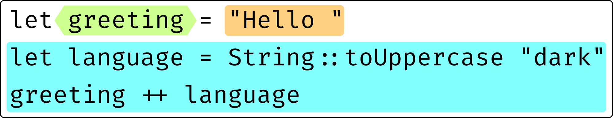

The second `let` (which is the body of the first let) also contains subexpressions:

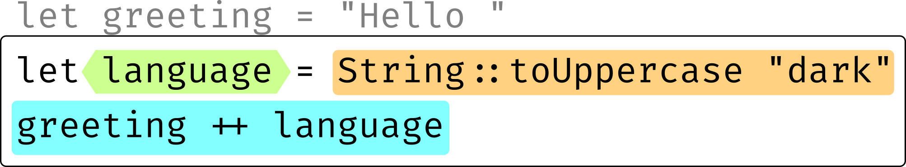

The value expression of this `let` is a function call containing an expression as its argument:

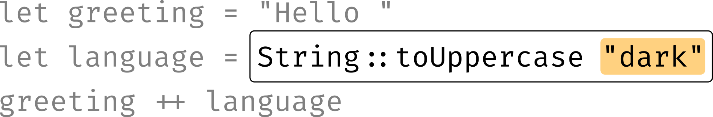

The body of the second `let` is a string concatenation expression:

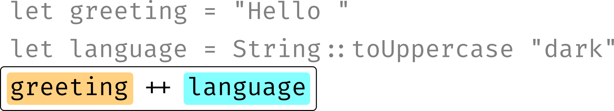

The rest of this section covers the kinds of expressions that are part of the Dark language.

## Basic Expressions

### Blanks (Placeholders)
A blank expressions acts as a placeholder where you can type to create a different expression. The *value* of a blank expression is `Incomplete`, because it needs to be completed in order to be useful.


Once a blank is filled in, it won't be a blank anymore:


Filling a blank with an expression with sub-parts introduces a new blank for each of them:


### Partials (Partially Completed Expressions)
While you are typing or deleting, you'll often see partially completed expressions like this:


The text in red is the partial, and the grey text behind it indicates what was there before. Note that partials evaluate to whatever was there before:


...until you complete them from the autocomplete:


### Common Atomic Expressions
Dark supports:
- Integers (whole numbers like `42`)
- Floats (numbers like `1.5`, `.51`, and `3.`, which have a whole and fractional part)
- Strings (text in double quotes like `"Dark is expression-oriented"`)
- Bools (`true` and `false`)
- `null`

Each of these expressions evaluates to its contents as you might expect. For example, `42` evaluates to the Int value `42`.

### Lists
A List expression in Dark is a comma-separated list of sub-expressions within square brackets `[]`.
Lists are implemented as linked lists, which means that random access is O(n), not O(1).


### Records
Record expressions in Dark use curly braces `{}` and colon-separated key-value pairs. Keys are alphanumeric identifiers, and values can be any subexpression.

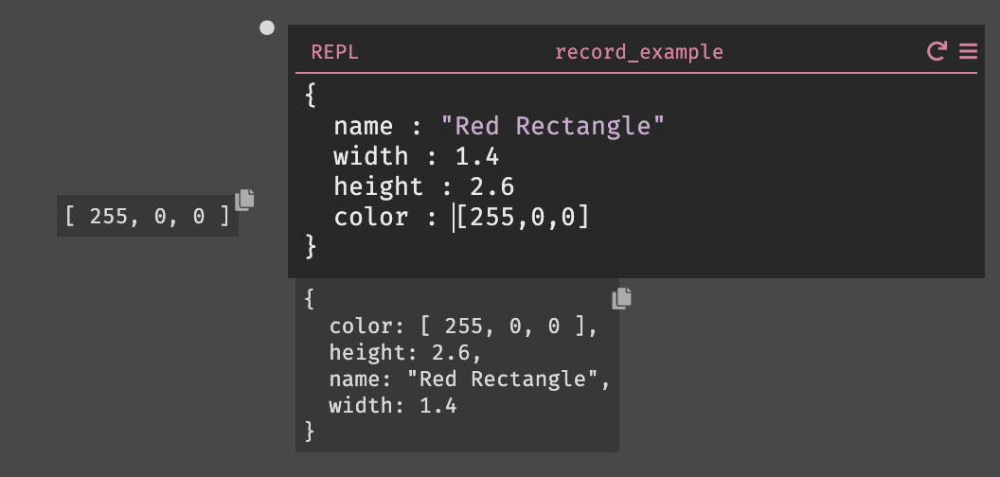

If you have an expression that evaluates to a record, you can use field access `.` notation to access the value corresponding to a key:

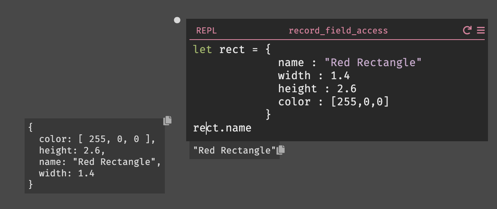

## Variable Binding with `let` Expressions

In an imperative language with mutable types, like Javascript, you declare variables and use statements to change their values. In Dark, variables are immutable, and you can think of a variable as an alias for a previously-evaluated expression.

You use `let` expressions to introduce new variables in Dark.
A `let` expression has 3 parts: a variable *name* and two sub-expressions: a *value* expression and a *body* expression. The *value* expression is evaluated once, and any uses of the *name* within the *body* expression will share that value.


In this example, we're binding the value of the expression `String::toUppercase "Dark"` to the variable name `name`:

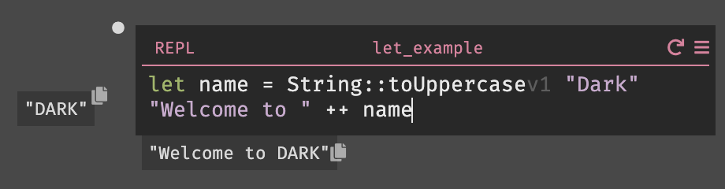

Note that `name` acts as an expression with the value `"DARK"` in the body of the `let`.

## Function Calls and Binary Operators

You can find a list of built-in functions and binary operators [here](https://ops-documentation.builtwithdark.com/?pretty=1).
You can also create your own functions.

## Control Flow

In imperative languages like Javascript, conditionals are implemented with statements. In Dark, they are implemented with expressions. When writing conditional expressions in Dark, keep in mind that the type of the value to which each conditional branch evaluates should match.

### If Expressions

`if` expressions have 3 parts: a boolean *conditional* expression and two branches, a *then* and *else* expression.
The value of the *conditional* expression determines whether the *then* or *else* expression is evaluated. The value of the evaluated branch becomes the value of the `if` expression as a whole.


### Safely Representing Errors and Null
Dark Constructors provide a way of safely representing the presence or absence of a value or an error.
You use `match` expressions (see [below](#match-expressions)) when working with the resulting values.

#### Options
If you want to conditionally express something or nothing, you can use `Just someExpression` or `Nothing`, which are both of type `option`.


Using an `option` in a situation where you might use `null` in another language forces downstream code to explicitly handle the `Nothing` case. That means you can't forget to add null checks. The [error rail](error-handling#error-rail) makes `option`s a bit friendlier than they are in many functional languages.

#### Results
If you want to conditionally express success or failure, you can use `Error someExpression1` or `Ok someExpression2`, which are both of type `result`. Note that `someExpression1` and `someExpression2` may intentionally evaluate to completely different types. For example, you might write a function that returns `Ok 200` or `Error "Timed out"`.

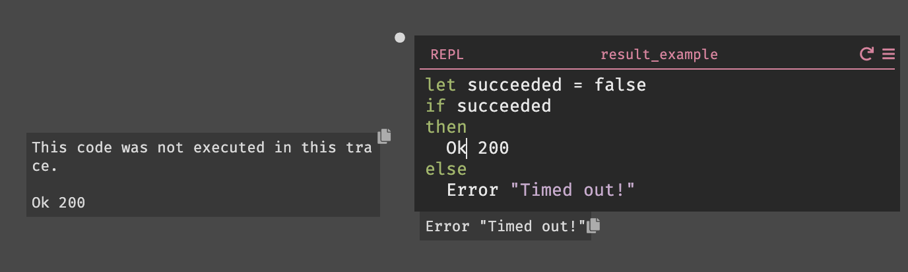

While `option`s force you to check for `Nothing`, `result`s enforce error handling. The [error rail](error-handling#error-rail) makes `results`s a bit friendlier than they are in many functional languages.

### Match Expressions

`match` expressions provide conditional evaluation of one or more expression branches. They may also introduce new variable bindings.
Every match has a single *value* expression that is evaluated once and *matched* against one or more *patterns*. The first pattern that matches the evaluated *value* indicates the expression to evaluate. The value of the evaluated expression becomes the value of the match as a whole.


A match expression can be used as a less-ergonomic `if` or `let` expression:


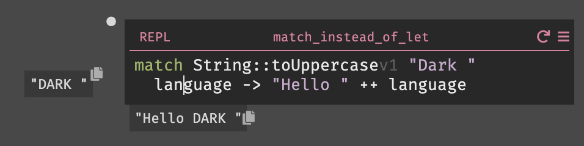

But `match`es truly shine when used to safely unwrap constructors, as in this error handling example:


**Warning:** Be careful when using a match in combination with a `let` binding. If you use the same name for the `let` variable and one of the `match` patterns, the variable introduced by the pattern will shadow the let variable. That might not be the behavior you expect:

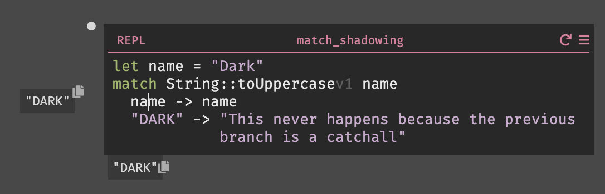

#### Patterns
The *pattern* part of a match branch can't be an arbitrary expression. Dark currently supports matching against the basic types `Int`, `Bool`, `String`, `Float`, and `null`.

Dark also supports variable and constructor patterns. This example uses a `Nothing` constructor pattern, an `Int` pattern, and a `Just` constructor pattern containing a variable pattern:

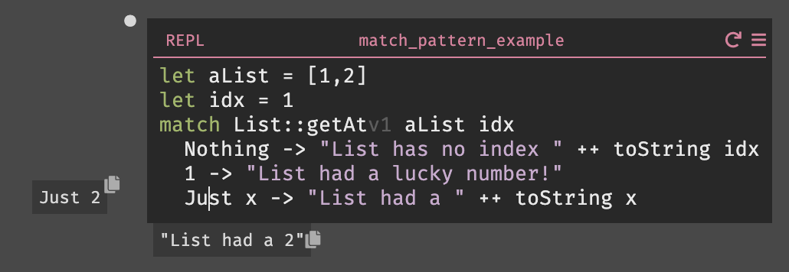

Notice that `2` is bound to the name `x`.

## Pipelines for Readability

Pipelines are a way to make Dark code more readable. They allow you to create a chain of expressions, where each chain is an input to the next expression in the sequence.


Pipelines are described in much more detail [here](functional-aspects#pipelines).

## Lambdas for Manipulating Lists and Datastores

Dark doesn't use `while` or `for` loops to transform lists and query datastores. Instead, you use lambdas in conjunction with functions like `List::map` and `DB::query`. Lambdas are anonymous functions of type `Block`. Lambdas start with backward slashes `\` and have a series of comma-delimited named parameters that are scoped to a *body* expression.

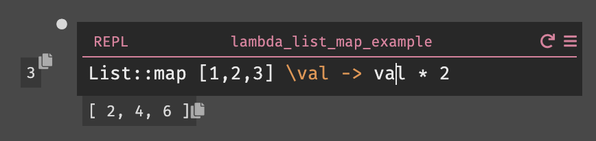

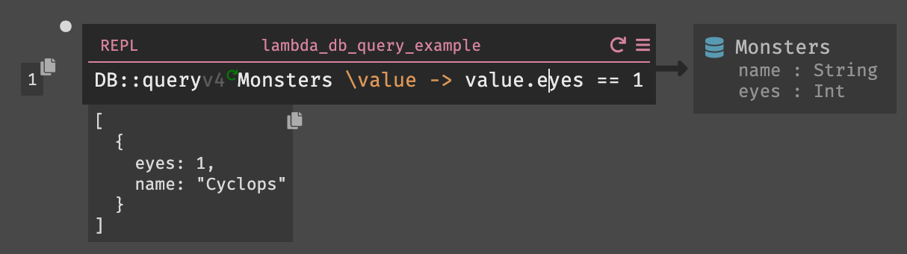

Lambdas are described in more detail [here](functional-aspects#listmap--lambda).
