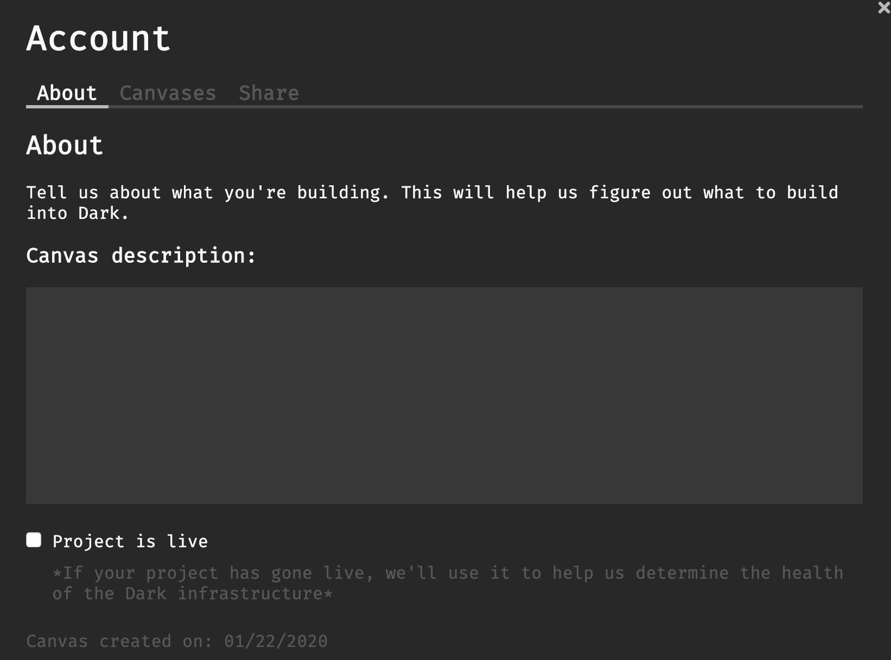
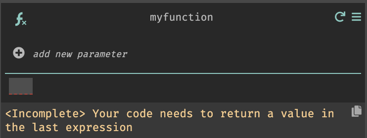
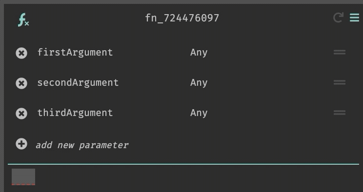
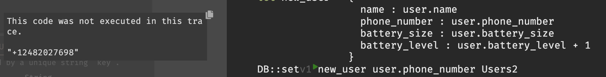
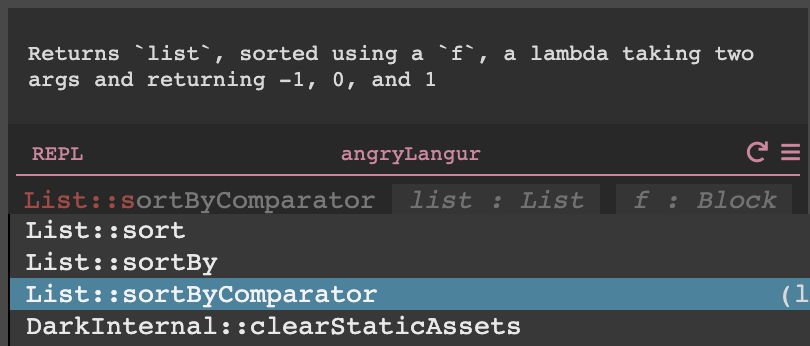
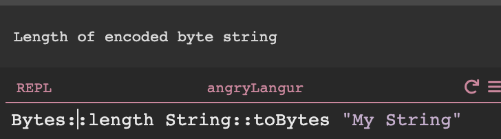
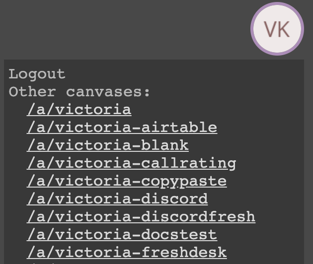
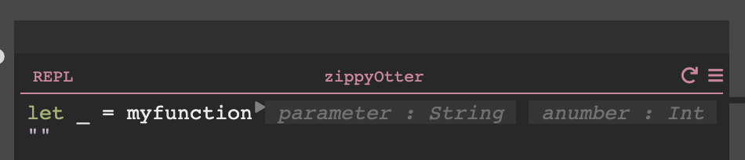
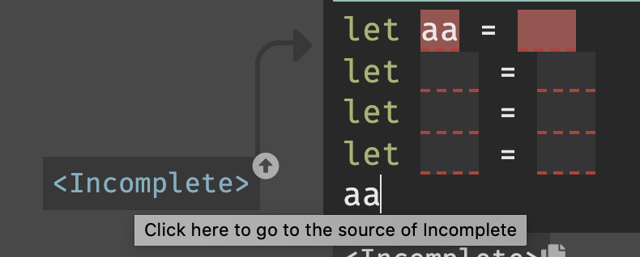

Dark gets better each week! Here is a brief list of the fixes, new features, and updates.

## Week of 3/20/2020

- Now you can give us more information about your Dark projects, and let us know if they're live. This helps us understand how we can make Dark better for you!

- Significantly faster HTTP requests and canvas loading. We "fixed" this a few weeks ago, but only saw modest improvements. Yeah, there was a bug. So now it's fixed fixed: some HTTP requests have dropped from 3s to 70ms.
- We've added lots of standard library functions:

  - `Float::absoluteValue`
  - `Float::negate`
  - `Float::power`
  - `Float::min`
  - `Float::max`
  - `Float::truncate`

    

  - `Int::negate`
  - `Int::absoluteValue`
  - `Dict::isEmpty`
  - `String::isEmpty`
  - `Date::weekday`
  - `Bool::xor`

## Week of 3/13/2020

### Features

- We now tell you how to deal with the ErrorRail in the docstrings for functions that returns `Options` and `Results`

- We've started narrowing down the types in the autocomplete using types, and we now have some nice error messages for options which don't match the types

- `DB::query` (and other `DB::query` functions) now support `Date` operations
- Performance: We've improved the load speed of your code on our servers by about 3x over the last few weeks, with the final change landing this week. This has the largest impact when loading the editor as all of your code loads then (though it is also less noticeable there as the JS overhead is higher than the DB overhead so 🤷🏽‍♀️)
- We have launched an alpha [package manager](https://darklang.github.io/docs/packages), which allows re-using Dark functions from other users or canvases. Today, only Dark employees can add functions to the package manager. We've started with some commonly used Slack functions, but let us know via Slack or email if you have any requests - or your own functions you'd like to share.

### Bug fixes

- Entering `+` no longer causes extraneous characters to be placed
- Uploading static assets on Windows no longer fails for nested directories
- Adding a `let` above a pipe no longer results in unexpected behavior

### Documentation

We added a bunch of improved documentation, including:

- better docs for hosting [static assets](https://darklang.github.io/docs/static-assets)
- a new doc describing [Datastores](https://darklang.github.io/docs/datastores) in more detail
- a new doc describing our (very limited) support for [packages](https://darklang.github.io/docs/packages)
- [a new doc describing the HTTP client library](https://darklang.github.io/docs/httpclient)
- a new doc describing how to [respond to HTTP requests](https://darklang.github.io/docs/http)

## Week of 3/6/2020

- Invites! You can now invite people to Dark from within the app. (If you want your invitees to collaborate in your canvases, you still need to ask us though — coming soon). Click "Share Dark" to invite people!

  

- There is now a link to documentation in the profile menu
- You can now move around the canvas using your mouse. Just click and drag!
- Added a bunch of functions:
  - `Int::max`
  - `Int::min`
  - `String::startsWith`
  - `String::endsWith`
- Fixed a bunch of bugs:
  - you couldn't type a comma in a list within a `match` statement.
  - you couldn't type `|>` to pipe at the end of functions with no arguments
  - scrolling in the sidebar works again
  - When calling `StaticAssets::serveLatest` with JSON files, we now return the JSON properly
  - If you press enter at the end of a line in an `if` statement, we no longer take you to the next line (this simplifies code like `if i < 10`)
  - Show when traces were not executed in `match`es (we already do this elsewhere)
- The command palette's documentation appears properly (press `Alt-x` to show the command palette)
- You can now use `Date::<` and `Date::>` and `Float::lessThanOrEqualTo` in `DB::query` (and also in `DB::queryOne`, `DB::queryWithKey`, etc)

- We now give better error messages when you try to use `Int` functions (like `+` and `-`) on `Floats` or `Strings`

- When you try to use invalid canvas names (eg, with capital letters), we now error much better
- When backspacing function names, we now delete the version automatically, which makes it clearer what's being deleted.

## Week of 2/28/2020

- Backspacing a comma in a list no longer deletes text to the right of the comma
- Fixed an issue where CRONs occasionally continued to run after they were deleted
- Lists now wrap when they pass 120 characters
- A few fixes to traces that caused people to get really stuck:
  - Fixed an issue where traces could occasionally vanish
  - Fixed an issue where clicking a Play button on a function in a REPL would not cause a trace to appear

### Documentation

- Docs can now be accessed at [https://darklang.com/docs](https://darklang.com/docs)
- [Your first Cron](https://darklang.github.io/docs/first-cron) and [Your first Worker](https://darklang.github.io/docs/first-worker) sections have been added to the Getting Started guide

## Week of 2/21/2020

- The canvas list has been moved into a Settings modal, accessed by mousing over your avatar and clicking Account.

  

- A variety of issues were fixed around autocomplete:
  - New variables now correctly display their type instead of Incomplete.
  - Autocomplete now appears correctly for single-character variables.
  - It was possible to get into a state where your variable was not added to autocomplete - this is no longer possible.
- Added improved error messaging for missing return values on HTTP handlers and user functions.

- Having the experimental web platform flag turned on in Chrome should no longer cause broken functionality.
- The Delete Handler menu option has been changed to Delete, for clarity.
- A complete [documentation](https://darklang.github.io/docs/introduction) restructure, including URL changes - old bookmarks may no longer work.

## Week of 2/14/2020

- Added a Welcome to Dark modal for new users

  

- You can now click on the Command Palette
- Function arguments can now be reordered

- You can now delete recursive functions
- We now show you when a value was not executed in this trace

- Live values are now shown in unexecuted `match` branches
- Fixed a bunch of redirection bugs after log-in
- Support pasting more JS objects into records
- Fixed the documentation for `Date::parse` (it returns a `Result`)
- Fixed a few bugs around autocomplete appearing too little or too much
- Fixed a carat placement bug in pipes
- Loaded our font (FiraMono) even if you don't have it installed locally
- Fixed some issues causing the editor to freeze:
  - Dragging up to select text
  - Repeated clicking in a variable
- Fixed some issues around copying `match`es
- Added a [Getting Started](introduction.md) tutorial to the documentation

## Week of 2/07/2020

- You can now reset your password (thanks to a switch to Auth0)
- Released a new version of the Dark CLI (0.5). This is a required upgrade to upload static assets.
  - [https://dark-cli.storage.googleapis.com/0.5.0/dark-cli-apple](https://dark-cli.storage.googleapis.com/0.5.0/dark-cli-apple)
  - [https://dark-cli.storage.googleapis.com/0.5.0/dark-cli.exe](https://dark-cli.storage.googleapis.com/0.5.0/dark-cli.exe)
  - [https://dark-cli.storage.googleapis.com/0.5.0/dark-cli-linux](https://dark-cli.storage.googleapis.com/0.5.0/dark-cli-linux)
  - Going forward, the Dark CLI will tell you when your CLI is out of date.
- Added `wrap-in-match` to the command palette

  

- Added new functions:

  - `List::sortByComparator`

  

  - `Bytes::length`

  

- Changing functions now keeps the old function's error rail setting
- Significant improvement in cursor position
- Moved our documentation to a [new, more readable format](https://darklang.github.io/docs/)
- Documented [how to set CORS in Dark](https://darklang.github.io/docs/docs/getting-started.html#additional-informationadvanced-topics)

## Week of 1/31/2020

- You can now see a list of all of your canvases by mousing over your avatar.

  

- Typing when text is highlighted now causes text to be replaced instead of inserted

  

- Many function improvements, including:

  - We now create functions without a default parameter. Apparently that was annoying.
  - Functions now have a menu, and you can delete functions from there if they are unused)
  - Sometimes the Add New Parameter action didn't work - fixed it.

  

- User-created functions now show parameters in blanks

  

- Improved load time of canvases with many traces
- The cursor now stays in the right place when we reflow/reformat code dynamically, in almost every case.
- Prevented you from creating two datastores with identical names
- Added `HTTP::setCookie_v1` - v0 incorrectly URL encoded some fields and is now deprecated
- Fixed an issue where text was sometimes not being properly displayed in the sidebar
- Added a warning when trying to access Dark from a non-desktop or non-Chrome browser

### Documentation

- Created a [Sharing Dark Projects](https://www.notion.so/darklang/Sharing-your-Dark-Projects-26d5b14d6b41457daad6bc44ac849b1a) guide
- Improved the steps at the beginning of the [Guide to Building a Backend for a React SPA in Dark](https://www.notion.so/darklang/A-Guide-to-Building-a-Backend-for-a-React-SPA-in-Dark-29ccf25d75bd48daa32b92e4bd555669)

## Week of 1/24/2020

### Major changes

- Errors/Incompletes now point to the cause of the error

  

- We substantially improved keyboard entry:
  - Special characters on international keyboards now appear correctly
  - Infix functions as parameters to other functions work
  - We believe backspace should now always work perfectly
  - We've greatly improved how often the cursor appears in the right place
- Performance and loading improvements for all programs
  - The editor loads program data from the server much faster
  - Workers run with much less overhead (and so higher throughput)
  - CRONs should be running more reliably
  - HTTP requests are much much faster
  - Programs with lots of functions or traces are especially improved
  - Several issues with deleted functions and databases are now resolved
- Copy/paste is way improved

  - you can paste code from Dark into other programs
  - you can paste code into many parts of Dark (varnames, strings, records, etc)
  - most copy-paste issues should be solved

  

### Library changes

- Added `JSON::parse_v1` which uses a Result in case of error (deprecated JSON::parse_v0)
- Added `Float::sum`

  

- More improvements to `DB::query` and friends
  - previews now work for all `DB::query` functions (`DB::queryOne`, `DB::queryOneWithKeys`, `DB::queryWithKeys`)

### Bug fixes

- Fixed up/down arrow on fields
- Single entry autocompletes now work
- Cmd-arrow with shift now maintains selection
- Fixed renaming function parameters
- Fixed deleted text persisting when pressing delete
- Large traces are now properly displayed
- Commands (Alt-x/Option-x) now work more reliably when selecting code
- We now allow you to use arbitrary field names
  - You can now use a field even if you don't have a trace or the field does not exist in that trace
- We've automatically disabled Grammarly, as it was messing with our DOM
- The dark-cli now prints errors on failure

### Documentation

- A [list of sample canvases](https://www.notion.so/darklang/Sample-Canvases-a5fa5479ffbb442d9f180d83e4bf3588) and descriptions has been added

## Week of 1/17/2020

- We added DB::query_v4, which allows you use arbitrary queries on your Dark datastores
  - We also published a [related blog post](https://medium.com/darklang/compiling-dark-to-sql-bb8918d1acdd)!
- You can now remove a `let` with the backspace/delete key

- Improved [documentation around the Error Rail](https://www.notion.so/darklang/Error-Handling-in-Dark-255f7989a63b4dd49da63cca17ee107e)
- GitHub API! See our [sample canvas](https://darklang.com/a/sample-github) demonstrating how to call the Github API
- Fixed an issue where deleted from the middle of a concatenated string would cause text to the right of the deletion point to be removed.

- We asked y'all to not make HTTPClient calls to your Dark canvas from REPLs. We've made some infrastructural changes that fix the issue on our end, so you should feel free to do that now. This is useful if you want to create a HTTP trace without leaving Dark. (Note: please don't make HTTPClient calls **_to Dark_** from HTTP handlers)

## Week of 1/10/2020

- Fixed a bunch of issues around entering non ASCII characters, especially from non-US keyboards:
  - accented 'o' and 'a' characters were not being recognized from Swedish keyboard layouts.
  - € or £ weren't working
  - shift + 2 was not being recognized.
- Fixed an issue where pressing delete in a match expression was causing the cursor to be placed incorrectly.
- Stopped errorring when functions are being renamed.
- Fixed an issue where the Omnibox was not clickable.
- Fixed an issue where the minimap was hiding the Dismiss Error button.
- Fixed a short regression where lambda parameters were not shadowing variables of the same name.
- Deprecated the `Date::sub` function and replaced it with `Date::subtract`.
- Changed the behavior of new handler placement - they no longer appear directly on top of one another.
- Changed the behavior of partials - they are now abandoned when clicking away from a handler.
- Added the `copy-request-as-curl` command for `HttpClient::` functions - use Alt-x/Option-x to activate
- Add `Twitter::urlencode` and `Crypto::sha1mac` to support talking to the Twitter API
