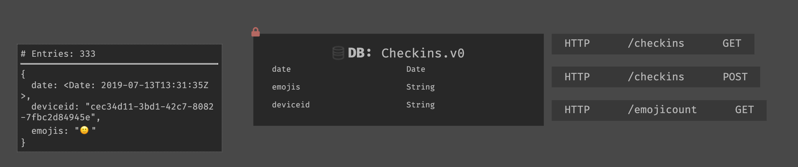
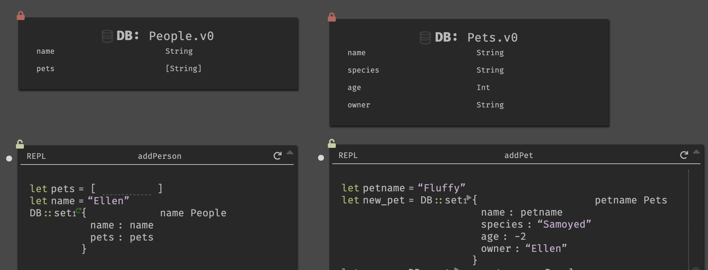
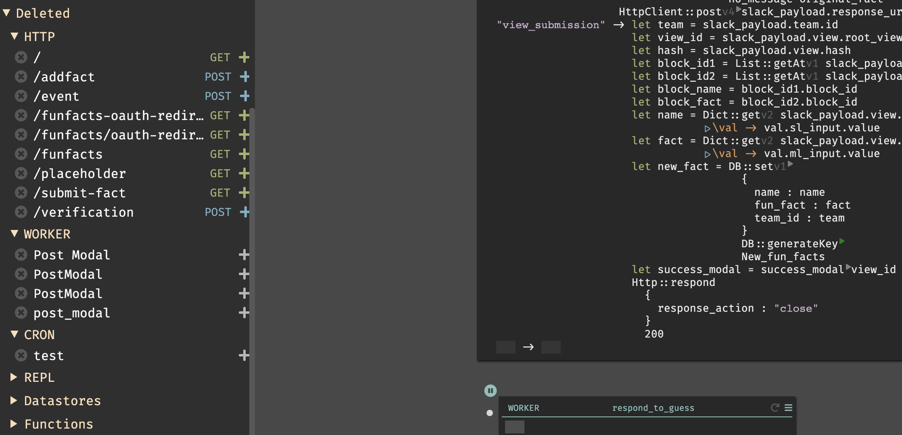

When building in Dark, you are able to create five major backend components, called handlers:

- API Endpoints (REST)
- Background workers (with built in event/queue system)
- Scheduled jobs/cron
- Persistent Datastores (key-value/hashmap)
- REPLs (internal tools)

These components live on your canvas. They are created from the sidebar, or by hitting cmd-k to bring up the omnibox.

Dark code is meant to be written in these handlers. We always recommend writing code within these components, and then extracting that code into a function, using alt-x, as needed. Code written in Dark is expression based, and as you add an expression it will automatically create blanks for the parameters it takes. If you delete an expression, the parameters will also be removed.

These components **do not** require you to set up any additional infrastructure or deployment processes. As soon as you create them, they’re available and update as you write code (deployless). Each handler is of one of these types, and has a name as well as additional information. You can see examples of each component [here](https://darklang.com/a/sample-helloworld).

All of these components support core Dark functionality:

- Trace data & live values (see: [Trace Driven Development](trace-driven-development.md)).
- Implicit returns & pipelines (see: [Functional Aspects of Dark](functional-aspects.md)).
- Autocomplete (i.e. typing **DB::**) will return all the datastore functions. This also works by type.

More on each type is below, but we recommend continuing to [Trace Driven Development](trace-driven-development.md) and coming back when you are creating an endpoint.

---

## Canvas

In Dark, your backend components appear in the browser, on a canvas. These are at: [https://darklang.com/a/username](https://darklang.com/a/username) or [https://darklang.com/a/username-canvasname](https://darklang.com/a/username-canvasname). We intend for you to only have one canvas per company or entirely separate project. You can create any canvas by navigating to it.

Your endpoints would appear at: [https://username-canvasname.builtwithdark.com/route](https://username-canvasname.builtwithdark.com/route) (we can help you set up DNS if you want another domain to point at your canvas).

You can navigate the canvas via the left-hand sidebar, or via the omnibox (accessible using cmd/ctrl-k).

---

## REST API Endpoints

- If you hit an endpoint that does not exist (see: [Trace Driven Development](trace-driven-development.md)), the endpoint will appear in the 404 section.
- Support the standard REST protocols (GET, POST, PATCH, DELETE, PUT).
- Accept url parameters (ex: /profile/:username) and appear as variables within the handler.
- Have implicit returns (see: [Functional Aspects of Dark](functional-aspects.md)), and return JSON by default.
- All traces are available as dots on the LHS. If you do not have a trace selected, you will see a spinner for all live values.

## Background Workers

- Workers receive events via the **emit** expression, and will appear in the 404 section if you emit to a non-existent worker.
- Run asynchronously and retry in case of failure.

## CRON

- Runs on a given schedule, selected by developer (every minute, hour, week, etc).

## REPL

- Is triggered only by the developer and frequently relies on play buttons (see [Trace Driven Development](trace-driven-development.md)).

## Persistent Datastores

In Dark, all datastores are a key-value store - a persistent hashmap/dictionary (not a relational database). When looking at a Datastore you’ll see the schema, all handlers that call the datastore, how many entries are in it, and a sample entry.

The best way to get a list of all DB functions is to open a REPL and type DB::, or check the [language docs](https://ops-documentation.builtwithdark.com/?pretty=1).

### Keys

Items are inserted and found using the key (which is string), and items in the datastore are unique by key. DB::Set prompts you for the key.

You can use an existing field as the key, i.e. in this example:

([https://darklang.com/a/sample-datastore](https://darklang.com/a/sample-database))

Both keys are set to be the name. (This would not be a great for a larger team as names would often be duplicated, but works for this example - email, fullname, or username would be a better key).

If you do not have a field that would be suitable as the key, you can use DB::generateKey.

### Inserting & Updating into the DB

- Use DB::set to put something in the DB. It takes a key, such as a user’s email: “DB::set user user.email Users”
    - if you don’t have a natural unique key, use DB::generateKey to generate a random one.
- Using DB::set with the existing key will overwrite the existing item.

### Using your Data from Another Datastore

#### **If your datastore has an HTTP API**

If your datastore has the ability to serve its data over an HTTP API, enable that and talk to it directly over HTTP.

Some datastores like Mongo have an admin panel that will allow you to do this (we can walk you through it).

#### **If your datastore doesn’t have an HTTP API**

Send us a message on our Community Slack and we’ll help you figure out the best thing to do based on what you want to do.

### Fetching & Querying from the DB

- Use DB::get to get a single item by its key.
- Use DB::getMany to get many items by key
- Use DB::getAll to get all items in the DB.
    - You can then use list::Take to get the first n items.
- Use DB::query, DB::queryWithKey, DB::queryOne and DB::queryOneWithKey to search the DB for items by the value of their fields.

`getMany_v1`, `getAll_v1`, `queryWithKey_v1` all return a list of [Key, Item] lists. Ie. a list of lists where the inner list is a two-item list where the first item is the key of the item and the second item is the item itself. This is to allow you to `set_v1` the item back into the datastore if you update it and the key is not derivative of the item itself. (eg. key is a UUID)

If you are doing a one-off query you can inspect your datastore using a REPL.

### Creating References Between DBs

This canvas shows the way to create a reference between two datastores: in this case between Dark employees and their pets: [https://darklang.com/a/sample-datastore](https://darklang.com/a/sample-database)

Users have a pets field, which is a list of strings. The keys for the pets are added to that list.

### Locking, Unlocking, & Migration

- You can edit the DB’s schema (col names and types) until it has data in it, at which point it “locks.”
- If you are still in development and don’t need the data, creating a REPL and deleting all data in a DB will unlock it (db::deleteAll). This is probably easiest.
- You can also copy and make a new, differently-named version of the datastore (i.e. Visits2) to make changes. You can ask in the Slack for best practices here.
- Setting DBs by type and DB Migrations are coming - requests or inputs please let us know.

## Deleted

If you delete a handler, we save that code for you in the Deleted section of your canvas. Everything you delete is sorted by type, and will remain in that section until you remove it.

