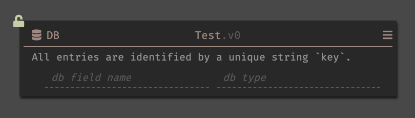

## Overview

Datastores in Dark are all key-value based (persistent hashmaps). When you create a new datastore, you specify the schema for the record.

The key is the unique identifier for each record, and is always of type `string`. **The key is not visible when looking at the Datastore's schema on the canvas.**  You cannot mark a record field as the key, but you can use the same value for the field and the key when using `Db::set`. An expected response when retrieving a set of records, with keys, is as following:

`[{key: {
        key1: value1,
        key2: value2}
}, {key: {
        key1: value3,
        key2: value4}]`

In the preview of the most recently added record, the key and record are both available.

### Keys

For all of the following example keys the schema of the Datastore would be the same, but the preview would show the value of the key of the latest entry:

Some common key choices: 

- A field that you plan to store that is unique (like userId). You may need to use `toString` if it is not already a string. The key is shown in the preview data.

`[{"1": {
        userId: 1,
        name: "Ellen",
        pets: ["Gutenberg"]}
}, {"2": {
        userId: 2,
        name: "Paul",
        pets: []}]`

- A a derivative of a field you plan to store that will be unique (such as generating a slug from two fields).

`[{"ellen1": {
        userId: 1,
        name: "Ellen",
        pets: ["Gutenberg"]}
}, {"paul2": {
        userId: 2,
        name: "Paul",
        pets: []}]`

- A generated unique identifier (`DB::generateKey`).

`[{"dee09c7e-6ede-402d-9ea4-4ee8fe843688": {
        id: 1,
        name: "Ellen",
        pets: ["Gutenberg"]}
}, {"ac7d4f1f-a164-4450-96f3-728b087bb9f4": {
        id: 2,
        name: "Paul",
        pets: []}]`

### Values

The value in the datastore is a record. In the future, we'd like datastores to be defined by type, but for now you can manually create the schema. Available types are: String, Int, Bool, Float, Password, Date, UUID, Dict (or lists of those).

## DB Functions

Many datastore operators are built into the language of Dark. All functions are independently versioned. In your canvas you will see the latest version, as well as any versions you are currently using. 

A list of all datastore functions is available [in the language reference](https://ops-documentation.builtwithdark.com/?pretty=1).

### Adding a record to a Datastore
To add items into a datastore, use `DB::set`. `DB::set` takes three parameters (the record to be added, its unique key, and the datastore).

For the earlier example datastore, using this with userID as the key would look as follows:

Using the a generated key with `DB::generateKey` would look like this instead:

### Datastore meta-actions

Some datastore functions provide ability to do something to the entire datastore, and only require the datastore as the parameter. 

Any datastore function that includes 'with keys' returns both the key and the value, a list of nested dictionaries `[{"1": {
        userId: 1,
        name: "Ellen",
        pets: ["Gutenberg"]}
}, {"2": {
        userId: 2,
        name: "Paul",
        pets: []}]`

Functions that do not include 'with keys' return just the values, a list of dictionaries `[{
        userId: 1,
        name: "Ellen",
        pets: ["Gutenberg"]}
, {userId: 2,
        name: "Paul",
        pets: []}]`

These include:
- `DB::count`
- `DB::deleteAll`
- `DB::getAll`
- `DB::getAllwithKeys`
- `DB::keys`
- `DB::schemaFields`
- `DB::schema`

### Querying by Key, DB::get

The key is a good way to be able to find information in the datastore. DB::get finds records by key (reminder: withKeys returns nested dictionaries including keys, so DB::get does not return the key). Datastore functions that allow action based on key are:

- `DB::delete`
- `DB::get`
- `DB::getMany`
- `DB::getManywithKeys`

### Querying by Specific Field in the Record, DB::queryExactField

Using DB::queryExactField checks for a specific field within the record. `queryOnewithExactField` finds one response, whereas `queryExactFields` will return as many as exist. (reminder: withKeys returns nested dictionaries including keys).

- `DB::queryExactFields`
- `DB::queryExactFieldswithKey`
- `DB::queryOnewithExactField`
- `DB::queryOneWithExactFieldWithKey`

### Experimental SQL Compiler, DB::query

For being able to run more effective datastore queries, we also have a query compiler. More about this feature is in this [blog post](https://medium.com/darklang/compiling-dark-to-sql-bb8918d1acdd).

DB::query allows taking a datastore and a block filter.

newquerycompiler

DB::queryOneWithKey_v3(Datastore table, Block filter) -> Option
Fetch exactly one value fromtablefor which filter returns true. Note that this does not check every value intable but rather is optimized to find data with indexes. If there is exactly one key/value pair, it returns Just {key: value} and if there is none or more than 1 found, it returns Nothing. Errors at compile-time if Dark's compiler does not support the code in question.

DB::queryOne_v3(Datastore table, Block filter) -> List
Fetch exactly one value fromtablefor which filter returns true. Note that this does not check every value intable but rather is optimized to find data with indexes. If there is exactly one value, it returns Just value and if there is none or more than 1 found, it returns Nothing. Errors at compile-time if Dark's compiler does not support the code in question.

DB::queryWithKey_v3(Datastore table, Block filter) -> Dict
Fetch all the values fromtablefor which filter returns true, returning {key : value} as an object. Note that this does not check every value intable but rather is optimized to find data with indexes. Errors at compile-time if Dark's compiler does not support the code in question.

DB::query_v4(Datastore table, Block filter) -> List
Fetch all the values fromtablefor which filter returns true. Note that this does not check every value intable but rather is optimized to find data with indexes. Errors at compile-time if Dark's compiler does not support the code in question.
