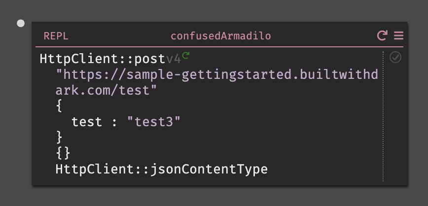

Try it out:

- Change your REPL to say "test3" instead of "test1" and then re-run the request by hitting the play button.

    

- A new trace dot will appear on the HTTP Post `/test` handler. It shows "test3" in the body of the request.

    

- Click on the datastore you will see the record added to the database.

    

Congratulations! You now have your first Dark application: an API that stores requests into a datastore.
