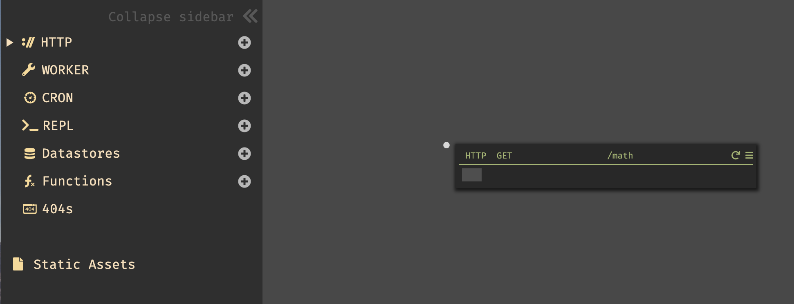
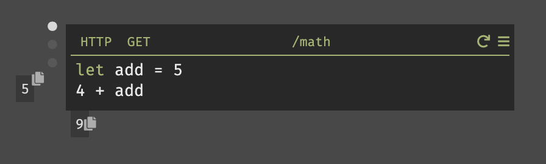

**Concepts:** Structural elements, blanks, implicit returns, traces.

1. Create a new HTTP endpoint from the omnibox (click anywhere on the screen or hit `Cmd-k`/`Ctrl-k`), or from the plus next to `HTTP` on the sidebar.

2. Specify that the verb is `GET` and the route is `/math`.

3. You can now write any code in the blank &ndash; this is the return value of the handler. To start with, let's just return `4`.

Click the hamburger in the upper right and select "open in new tab", to see your API endpoint running in production.

4. Go back to Dark to edit your code. Add `+ 5` to the end of the code and leave your cursor in line.

- The `9` at the bottom shows you the return value for the handler.

- The `5` on the left shows you the result of the expression where the cursor currently is (in this case, 5). This isn't very useful when it's an integer, but if it's a variable it will show you the result of the variable.

5. Mouse over the white dots on the left. Each dot is a "trace" of a single request to your handler.

Congratulations! You've shipped your first Dark API endpoint.
