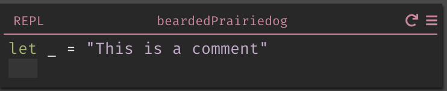
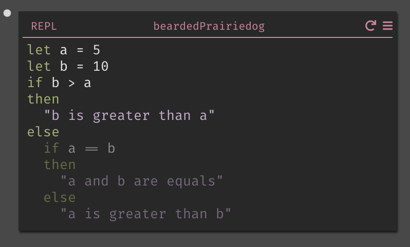

This guide will help you learn Dark if you're familiar with Javascript.

Have a tip to add to the guide? [Submit a PR](https://github.com/darklang/docs/pulls)!

## Comments

In Javascript, you use a `#` to start a single line comment, or `/*` and `*/` to wrap a multiline comment.:

```Javascript
// This is a comment

/* This is
also a
comment */
```

In Dark, you use a `let _ =` to start a comment, and you write the comment as a String:



## Strings

In Javascript, you can write a String in multiple ways:

```Javascript
"This is a string"
'This is also a string'
```

In Dark, you always use double quotes:


## Functions

In Javascript, you use the `function` keyword to define a function:

```Javascript
function helloWorld(){
    return "Hello World";
}
```

and you call a function with the function name, followed by parentheses:

```Javascript
helloWorld();
```

In Dark, you create a function from the sidebar:


This will open a new function in the function space, where you can define the name of the function and its contents:


## Standard Library/Built-in Functions

Javascript defines a set of built in functions that are called like this:

```Javascript
// This returns 2 to the power of 2.
Math.pow(2,2)
```

Dark has a set of built in functions as well, which can be accessed via the autocomplete:


## If/Else statements

In Javascript, you would write an `if` statement like this:

```Javascript
var a = 5
var b = 10

if (b > a) {
   return "b is greater than a";
}
else if (a == b) {
   return "a and b are equal";
}
else
    return "a is greater than b";
```

In Dark, the same statement would look this this:



Note that we highlight the path your code takes - so if we were to change the values, a different piece of the `If` statement would be highlighted:


