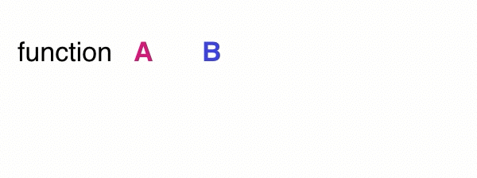
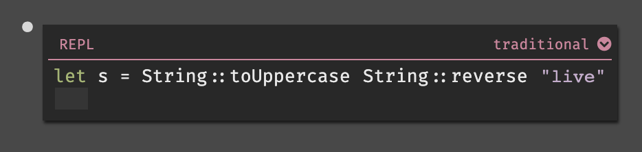
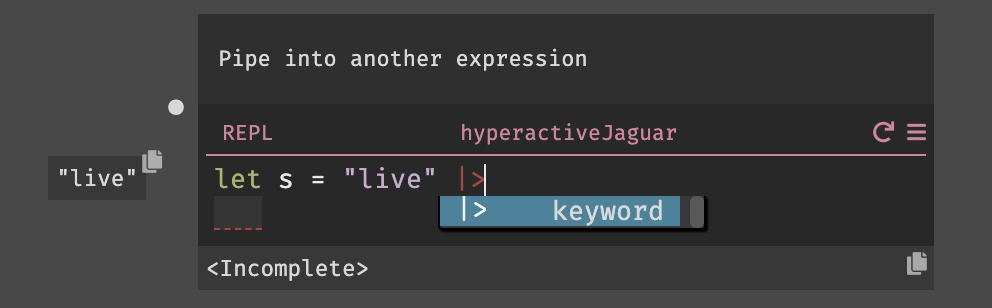
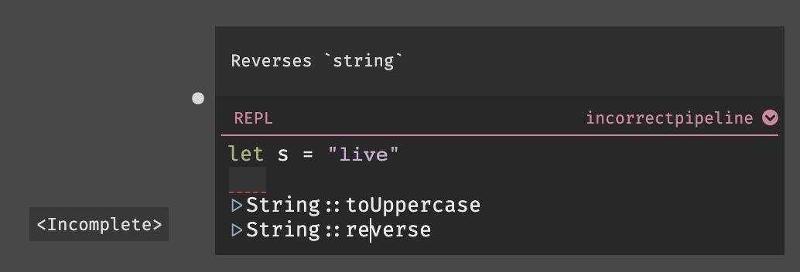
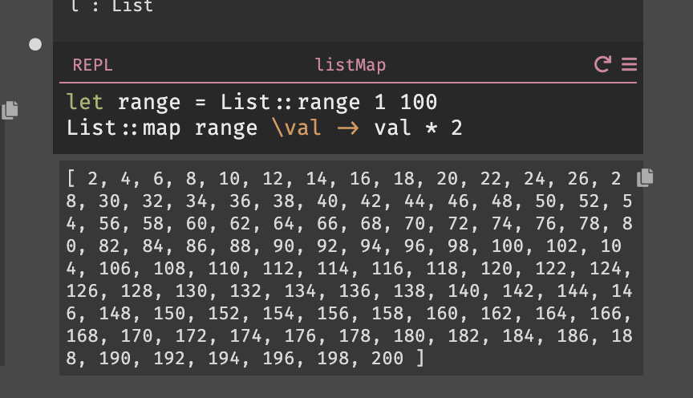
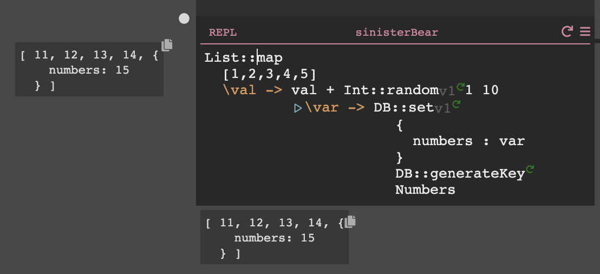
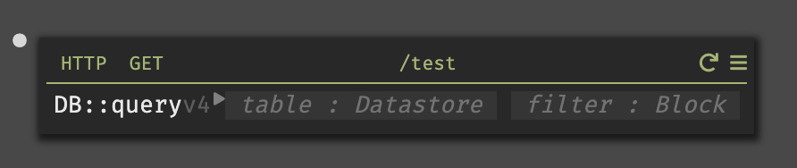

## Implicit Returns

Most languages, especially Javascript, are imperative: you tell it to do one thing, then do another thing. So whenever you have code, you can add more code below it to do more stuff.

Dark uses "implicit returns" (somewhat similar to Ruby, Coffeescript, Haskell and Rust). The value of an expression is that last value in that expression. So in the "hello world" example, you don't write `return "hello world"`, just `"hello world"` is enough.

A handler or function will return the result of the last expression within it. The return value of an expression is shown below the handler. If the last expression is blank, Dark will return a 500 error.

You can see some examples are shown here: [https://darklang.com/a/sample-returns](https://darklang.com/a/sample-returns)

Other computation (side effects) can be done using a statement.

## Statements

If you wish to use a function for side-effect (like `DB::set` or `emit`) then you can put it on the right hand side of a `let`.

Dark does not yet support statements without the extra `let`. When you hit “enter” at the end of a line that has a return value, we assume you want to make a new expression. Since that would be the last expression (and returned), we will automatically add the `let _ =` to the expression for you.

## Pipelines

### Overview

In Dark, pipelines make code more readable. Pipelines are similar to method chaining in OO languages, and pipes in Bash. Rather than calling functions with their parameters, you pass the previous value into the **first** parameter of an expression:

Traditionally, you call functions with their arguments as parameters. However, that is often confusing and can be hard to read:

Pipelines perform a series of transformations on a value in order. Here, we start with the string "live" and pipe it to String::reverse to produce "evil". Then we pipe the result to String::toUppercase, producing the string "EVIL":

### How to Pipe

To start a pipeline, use `|>` at the end of the expression you are piping.

Once you are in a pipeline, hitting `return` at the end of the expression will continue the pipe.

If you need to pipe a specific subset of an expression, you can select it and then hit `shift+return`. For example, selecting UUID::generate to pipe it into toString.

### Indentation Tip

Look at the indentation to see what is being piped. A common mistake with pipelines is introducing them at an unintended "level". For example, here the piped value is the let expression as a whole, but the author intended to pipe the expression bound to the variable s:

\_To view the live code provided in the examples above, visit [https://darklang.com/a/sample-pipeline](https://darklang.com/a/sample-pipeline).

## List::Map

Dark does not have a for-loop, it has `List::map.` This allows you to do something to a collection of objects in a list.

`List::map` takes two parameters. In this case we are passing in a list of integers, and a block.

In this case, we multiply each value by two:

If we wanted to do something involving subsequent list items, we can use a List fold (in this case we pipe the output of our previous list into list::fold), resulting in a return value of 10,100:

### Tips

- The live values within a block on `List::map` will show you the last item in the list. The live value for `List::map` shows the full outcome.
- **Known bug:** Right now, if you use a map with a function that has a side effect (like Int::Rand) the analysis will show you the impact of the _last_ version of the side effect as though it was used for all of them. This is an analysis bug (you are actually getting a random int each time).

List map with no side effect:

List map with a side effect, appears to use the same Int::random each time:

List map with side effect, discrepancy between analysis and values stored in DB:

## Blocks (lambdas, anonymous functions)

Blocks are anonymous functions that operate on a set of values. Expressions like `List::map` and `DB::query` take them as parameters.

To open the block type `\`. It autopopulates the parameters it is expecting (like `value` for `Db::query` or `accum, curr` for `List::fold`).

## Match

The match expression is used to destructure complex types. It can be used similarly to switch statements in other languages. At the moment, it only supports the Option type (Just and Nothing) and Result type (Ok and Error).

By default, functions that return Option or Result go to the [Error Rail](https://darklang.github.io/docs/unique-aspects#functions-that-use-error-rail). Once you remove the function from the Error Rail, use match for destructuring.

Here’s an example of using a match expression with a dictionary lookup.

