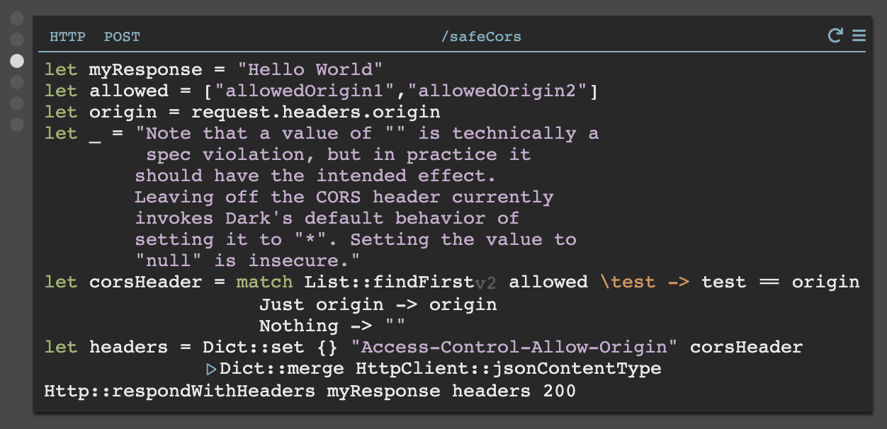

If you need support, the [Dark Community Slack](https://darklang.com/slack-invite) is the best place for front-line support. We’re very responsive during the day, and often responsive at all hours. Depending on the issue, we may need you to use a workaround. If you have an urgent issue you can call Ellen (248-202-7698) or Paul (415-341-2432).

## **README**

Dark is a radically different approach to software development. You can access your account at https://darklang.com/a/USERNAME.

1. Dark uses a set of structural backend components (API, Workers, Scheduled Jobs/Cron, internal tools, datastores). [Read this first](dark-backend-components.md).
2. Dark requires you to develop from incoming requests/traces (using your traces, live values, play buttons, and return values). [Read this second.](trade-driven-development)
3. Working safely in Dark relies on feature flags (Coming soon).

## Hello World:

## Language

- [All language functions](https://ops-documentation.builtwithdark.com/?pretty=1).
- The editor supports the language, so **DB::** will bring up all datastore functions, **List::** all list functions, etc. You’ll also see the doc strings in line. That said, a list of all expressions is [available here.](https://ops-documentation.builtwithdark.com/?pretty=1)
- Each expression in the language is versioned independently (**DB::getAll_v3**, for instance). You’ll always have access to the version you are using, and the latest version.
- If you have not used a functional language before, [Functional Aspects of Dark](functional-aspects.md) has an overview of the functional features in Dark (implicit returns, pipelines, pattern matching, and map instead of foreach).

## Editor

- The editor is *only supported* for Chrome *without* browser extensions. (Other browsers do not yet have all of the features we need. Browser extensions often interfere).
- If you are struggling with the editor and haven’t read them yet, we strongly recommend the overview of [backend components](dark-backend-components.md) & [trace driven development](trace-driven-development.md). The best place to start is writing line-by-line and checking the live value at each step.
- Write primarily in handlers, not functions.
- The editor is expression based, and it will help to think of it that way vs. as text or lines. Cursor placement is important. If you want to look at the result of an expression, or use a command on it, the :: is a good option for where to put your cursor.
- Enter completes a field and leaves the cursor at the end of that field, tab completes and moves to the next blank (even if the blank is not nearby), and space moves one space forward (as you would expect in text).
- The editor still has some quirks (we’re sorry!) please tell us about places where you feel like you can’t type, or are fighting with the editor. The best place to report bugs or feedback is the [Dark Community Slack](https://darklang.com/slack-invite).

## Additional Information/Advanced Topics

- Collaboration: Works like Google docs. If you need to share a project with another user, please request an organizational canvas via Slack.
- CORS: if you’re interested in setting CORS, we have internal tools do that! We're happy to do it in real-time with you to make sure it works. Drop us a note in Slack and we can get you set up. If you'd prefer to try it yourself, here is an example:

## Known Issues

- Large handlers cause performance problems.
- Recursion does not work well yet.
- Some quirks exist around international keyboards. Please report all instances of this in the Community Slack. In the short-term, you may need to switch to an English keyboard.

