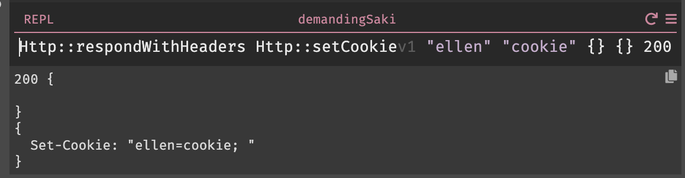

### HTTP

The `HTTP::` module provides functions to create responses to external HTTP
calls. Each response function, such as `Http::respond`, creates a response value; a response value
returned by the handler will be sent as a response to the client.

The live value beneath the handler will show the return value.

To set cookies, you can use `HTTP::setCookie` to create a suitable HTTP header.

