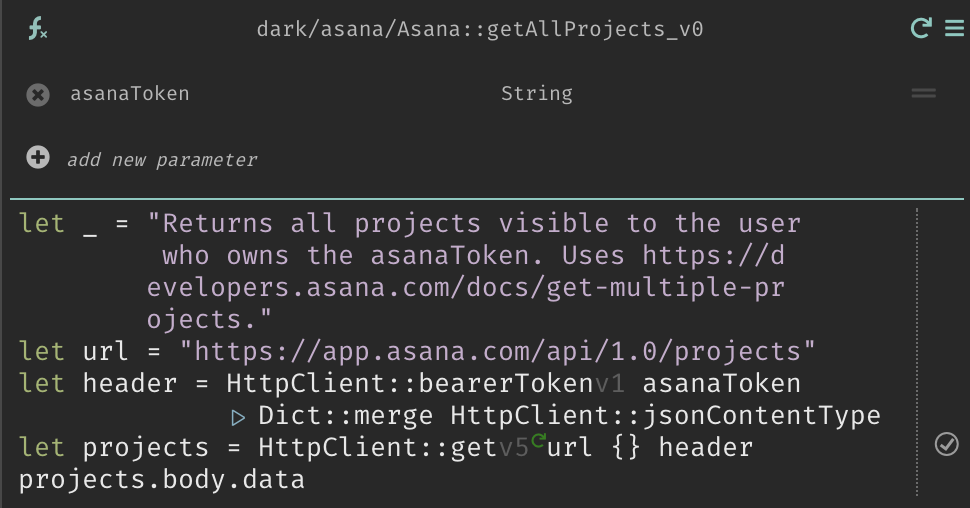
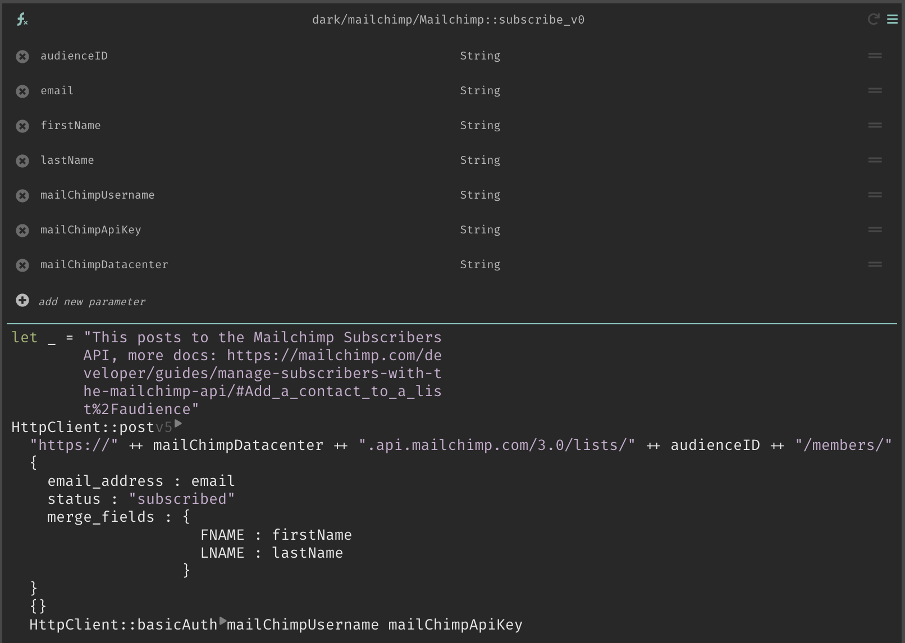
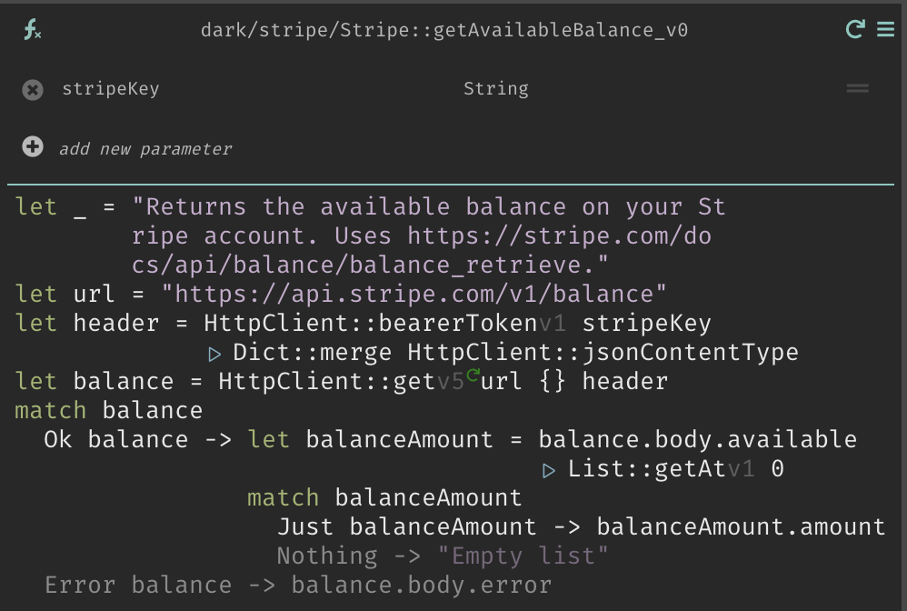

## Overview

Dark's alpha package manager allows re-using Dark functions from other users or canvases. Today, only Dark employees can add functions to the package manager. Packages are named by the creator, package, function, and version and are accessible via autocomplete. The package manager today is intended for connections to third party services and APIs.

In the future, packages will be imported vs. being continually accessible, and community members will be able to contribute directly. If you would like to request or contribute a package today, please reach out via Slack.

## Asana Package

### `createProject`

Takes a name (`String`), notes (`String`), workspace (`String`) and Asana token (`String`) and creates a new project in the specified workspace.

### `createTask`

Takes a name (`String`), assignee (`String`), project (`String`), notes (`String`) and Asana token (`String`) and creates a new task in the specified workspace. The assignee can be a user gid, email or null.

### `createTaskWithDueDate`

Takes a name (`String`), assignee (`String`), due date (`String` - 'YYYY-MM-DD' format) project (`String`), notes (`String`) and Asana token (`String`) and creates a new task in the specified workspace. The assignee can be a user gid, email or null.

### `getAllProjects`

Takes an Asana token as a `String` and returns details of all projects that token has access to.

### `getAllWorkspaces`

Takes an Asana token as a `String` and returns details of all workspaces that token has access to.

## Mailchimp Package

### `subscribe`

Takes an audience ID (`String`), email (`String`), first name (`String`), last name (`String`), Mailchimp username (`String`), Mailchimp API key (`String`), and Mailchimp data center (`String`) and posts to the [Mailchimp Subscribers API](https://mailchimp.com/developer/guides/manage-subscribers-with-the-mailchimp-api/#Add_a_contact_to_a_list%2Faudience).

## Slack Package

For a full list of Slack functions, click [here](slack-apps/slack-packages).

## Stripe Package

### `createCharge`

Takes a Stripe key (`String`), the amount for the charge (`String`), the currency (`String`), a customer id (`String`) and a card id (`String`) and creates a charge on that customer's card.

### `createCheckoutSession`

Takes a `list` of line items (amount, name, quantity, price, and currency), a customer ID (`Any`), a stripe key (`String`), a `cancelUrl` (`String`) and a `successUrl` (`String`).

### `createCustomer`

Takes a Stripe key (`String`), a description (`String`), an email address (`String`), a name (`String`) and a phone number (`String`) and creates a customer in Stripe.

### `createFullRefund`

Takes a Stripe key (`String`) and charge id (`String`) and issues a full refund for that charge.

### `createPartialRefund`

Takes a Stripe key (`String`), charge id (`String`) and amount (`String`) and issues a refund of that amount to the charge.

### `getAllCharges`

Takes a Stripe key (`String`) and returns all charges for that account.

### `getAllCustomers`

Takes a Stripe key (`String`) and returns all customers for that account.

### `getAllTransactions`

Takes a Stripe key (`String`) and returns all transactions for that account.

### `getAvailableBalance`

Takes a Stripe key (`String`) and returns the available balance for that account.

### `getCustomer`

Takes a Stripe key (`String`) and a customer id (`String`) and returns information about that customer.

### `getPendingBalance`

Takes a Stripe key (`String`) and returns the pending balance for that account.

## Trello Package

### `addBoardstoDB`

Takes a `list` of boards and a board Datastore. Adds the name and ID of each of the boards to the datastore.

### `addListstoDB`

Takes a `list` of Trello lists and a list Datastore. Adds the name and id of each of the lists to the datastore.

### `createNewCard`

Takes a `listID` (`String`), `trelloKey` (`String`), `trelloToken` (`String`), name (`String`) and description (`String`). Adds card with that name and description to the list specified.

### `getAllBoardsWithDetails`

Takes a `trelloOrgID` (`String`), `trelloKey` (`String`) and `trelloToken` (`String`) and returns all boards for that Trello org.

### `getAllListsWithDetails`

Takes a `trelloKey` (`String`), `trelloToken` (`String`) and Trello board id (`String`) and returns all lists for that Trello board.

### `getAllOpenCardsForMemberWithDetails`

Takes a `trelloKey` (`String`), `trelloToken` (`String`) and username (`String`) and returns all open cards for that Trello user.

### `lookUpBoardID`

Takes a board Datastore (containing names & ids) and a name (`String`) and returns the board id matching the name.

### `lookUpListID`

Takes a list Datastore (containing names & ids) and a name (`String`) and returns the list id matching the name.

## Upcoming Packages

We have some ideas of packages we intend to implement, but would love to hear what would be most useful.

## Contributions

If you'd like to share a function to the community, please send us a link to the function and we will set it up to be shared back! We love contributions for third party APIs.
