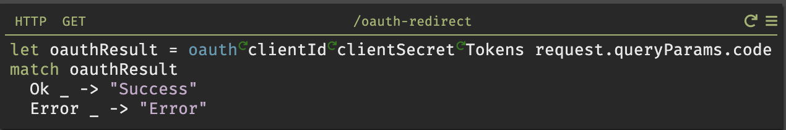

## Overview

Dark's alpha package manager allows re-using Dark functions from other users or canvases. Today, only Dark employees can add functions to the package manager. Packages are named by the creator, package, function, and version and are accessible via autocomplete. The package manager today is intended for connections to third party services and APIs.

In the future, packages will be imported vs. being continually accessible, and community members will be able to contribute directly. If you would like to request or contribute a package today, please reach out via Slack.

## Slack Package

The first package in the Dark package ecosystem is for the Slack API. Use these functions from autocomplete (dark/slack/Slack::), the same way you would any other function.

### getAllConversations

Takes your Slack token as a String and returns a list of Dicts containing both your public and private Slack channel names and ids.

### getConversations

Takes your Slack token as a String and returns a list of Dicts containing your public Slack channel names and ids.

### getPrivateConversations

Takes your Slack token as a String and returns a list of Dicts containing your private Slack channel names and ids.

### oauth

Takes your Slack clientID (String), clientSecret (String), token datastore (Any - but should be the name of your datastore), and oauth code (String) and returns a Result.

### postMessage

Takes your Slack token, channel id and text as Strings and posts the text to the Slack channel.

### scheduleMessage

Takes an Epoch time (Int), Slack token (String), channel id (String) and text (String) and schedules a message to be posted at the time specified. 

## Upcoming Packages

We have some ideas of packages we intend to implement, but would love to hear what would be most useful.

## Contributions

If you'd like to share a function to the community, please send us a link to the function and we will set it up to be shared back! We love contributions for third party APIs.
