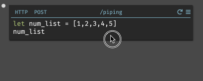

## Refactoring and editing code

### Undo/redo

Dark supports unlimited undo/redo in a single element. Undo with `Ctrl-Z`/`Cmd-Z` and redo with `Ctrl-Shift-Z`/`Cmd-Shift-Z`.

### Command Palette

If you’re looking to do something that is not immediately available, chances are it’s in the command palette (accessed by hitting `Alt-X`/`Option-X`). 

This includes the common refactoring tools:

- Extract a function or variable for re-use
- Create a type
- Wrap the current expression in a let (insert let here)
- Insert a let-expression above this one
- Wrap an expression in an if, if-then, or if-else

## More Refactoring Tools 

### Copy/paste

You can copy/paste selections, which is often used for refactoring. 

It may be helpful to note that copy/paste only works in Dark between handlers
at this time. Copying JSON from an external source will paste into your
handlers in Dark, but if you write code in the Dark language in your text
editor of choice, that code will not paste. We hope to improve this experience
in the future. 

### Pipelines

Pipelines are a key part of the Dark language. To start one, select the code
that has the result that you want to pipe, and hit `shift-enter` or type `|>`.

### Blocks/lambda

The arguments to map/fold/etc are functions, however currently, the only
argument allowed is an anonymous function (also called a block), which is
created by typing `lambda` or hitting `\`.

