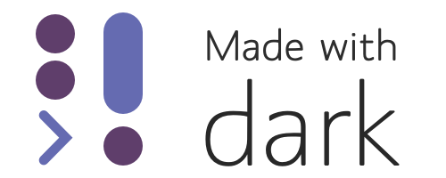

Thanks for being part of our private beta! We're excited for you to share your Dark projects. The most important thing to us is getting your feedback. We appreciate hearing about bugs, requests, etc, in the Slack.

That said, we're happy for you to share publicly. The best way to share code for now is often via screenshot (ex: [https://twitter.com/janiczek/status/1220519157135003649](https://twitter.com/janiczek/status/1220519157135003649)) although we're working on better ways to copy/paste out.

Here's a couple examples of users sharing about Dark:

- [Kevin Hoffman's blog](https://medium.com/@KevinHoffman/shedding-some-light-on-dark-9086b45988ed) about IoT sensors
- Tair's [snipy tool for Slack](https://snipy.io/).
- You're also welcome to tweet! If you tag us [@darklang](https://twitter.com/darklang) we'll try to RT, too.

## Made with Dark badge

Did your project launch? Give it a "Made with Dark" badge.

  

    
    
Files:
      <a href="assets/branding/md-color-light.svg" target="_blank">svg</a> |
      <a href="assets/branding/md-color-light@1x.png" target="_blank">png</a> |
      <a href="assets/branding/md-color-light@2x.png" target="_blank">png 2x</a> |
      <a href="assets/branding/md-color-light@3x.png" target="_blank">png 3x</a>
    

  

  

    
    
Files:
      <a href="assets/branding/md-mono-light.svg" target="_blank">svg</a> |
      <a href="assets/branding/md-mono-light@1x.png" target="_blank">png</a> | 
      <a href="assets/branding/md-mono-light@2x.png" target="_blank">png 2x</a> |
      <a href="assets/branding/md-mono-light@3x.png" target="_blank">png 3x</a>
    

  

  

    
    
Files:
      <a href="assets/branding/sm-color-light.svg" target="_blank">svg</a> |
      <a href="assets/branding/sm-color-light@1x.png" target="_blank">png</a> |
      <a href="assets/branding/sm-color-light@2x.png" target="_blank">png 2x</a> |
      <a href="assets/branding/sm-color-light@3x.png" target="_blank">png 3x</a>
    

  

  

    
    
Files:
      <a href="assets/branding/sm-mono-light.svg" target="_blank">svg</a> |
      <a href="assets/branding/sm-mono-light@1x.png" target="_blank">png</a> |
      <a href="assets/branding/sm-mono-light@2x.png" target="_blank">png 2x</a> |
      <a href="assets/branding/sm-mono-light@3x.png" target="_blank">png 3x</a>
    

  

  

    
    
Files:
      <a href="assets/branding/md-color-dark.svg" target="_blank">svg</a> |
      <a href="assets/branding/md-color-dark@1x.png" target="_blank">png</a> |
      <a href="assets/branding/md-color-dark@2x.png" target="_blank">png 2x</a> |
      <a href="assets/branding/md-color-dark@3x.png" target="_blank">png 3x</a>
    

  

  

    
    
Files:
      <a href="assets/branding/md-mono-dark.svg" target="_blank">svg</a> |
      <a href="assets/branding/md-mono-dark@1x.png" target="_blank">png</a> | 
      <a href="assets/branding/md-mono-dark@2x.png" target="_blank">png 2x</a> |
      <a href="assets/branding/md-mono-dark@3x.png" target="_blank">png 3x</a>
    

  

  

    
    
Files:
      <a href="assets/branding/sm-color-dark.svg" target="_blank">svg</a> |
      <a href="assets/branding/sm-color-dark@1x.png" target="_blank">png</a> |
      <a href="assets/branding/sm-color-dark@2x.png" target="_blank">png 2x</a> |
      <a href="assets/branding/sm-color-dark@3x.png" target="_blank">png 3x</a>
    

  

  

    
    
Files:
      <a href="assets/branding/sm-mono-dark.svg" target="_blank">svg</a> |
      <a href="assets/branding/sm-mono-dark@1x.png" target="_blank">png</a> |
      <a href="assets/branding/sm-mono-dark@2x.png" target="_blank">png 2x</a> |
      <a href="assets/branding/sm-mono-dark@3x.png" target="_blank">png 3x</a>
    

  

## Logo

If you write something about Dark, feel free to let your readers know that they can get into the Dark beta faster if they mention your name/username in their [application to the Dark beta.](https://darklang.com/beta)

If you'd like a logo to use in your website, blog, here is one:

Files: [svg](assets/branding/logo.svg) | [png](assets/branding/logo@1x.png) | [png 2x](assets/branding/logo@2x.png) | [png 3x](assets/branding/logo@3x.png)
