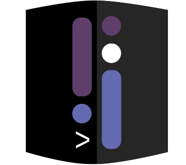

Thanks for being part of our private beta! We're excited for you to share your Dark projects. The most important thing to us is getting your feedback. We appreciate hearing about bugs, requests, etc, in the Slack. 

That said, we're happy for you to share publicly. The best way to share code for now is often via screenshot (ex: [https://twitter.com/janiczek/status/1220519157135003649](https://twitter.com/janiczek/status/1220519157135003649)) although we're working on better ways to copy/paste out.

Here's a couple examples of users sharing about Dark: 

- [Kevin Hoffman's blog](https://medium.com/@KevinHoffman/shedding-some-light-on-dark-9086b45988ed) about IoT sensors
- Tair's [snipy tool for Slack](https://snipy.io/).
- You're also welcome to tweet! If you tag us @darklang we'll try to RT, too.

If you'd like, you can suggest people who are applying to the beta after seeing your post to mention you by name/username. We'll accelerate their entry to Dark. 

If you'd like a logo to use in your website, blog, here is one:
