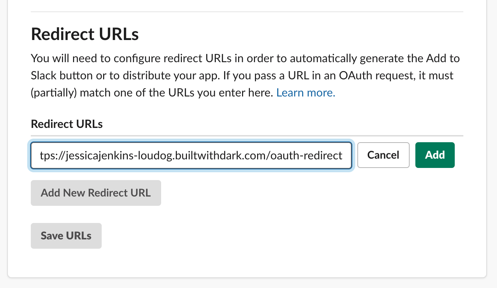
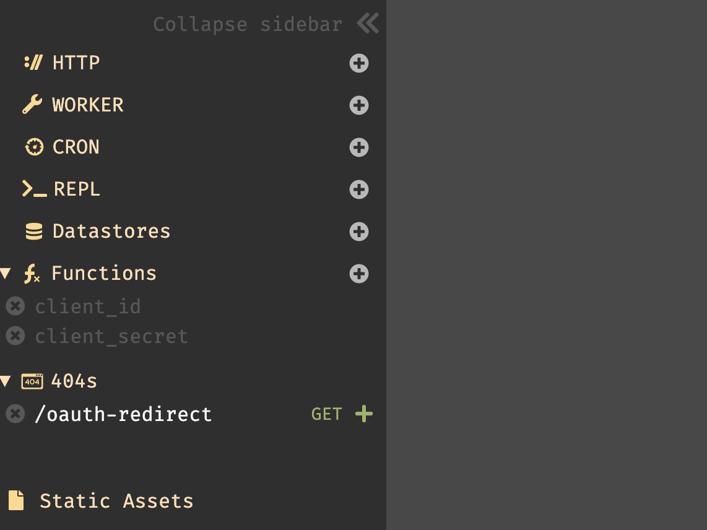
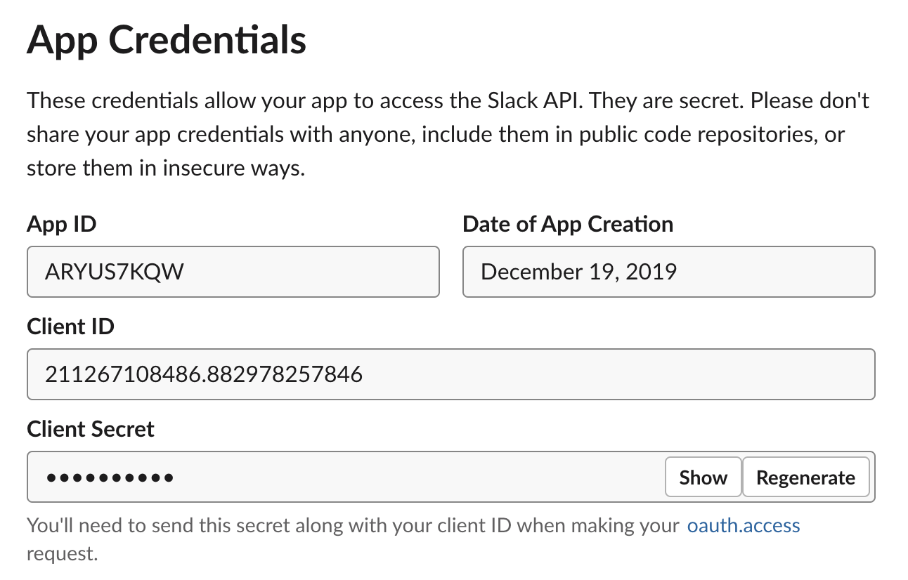
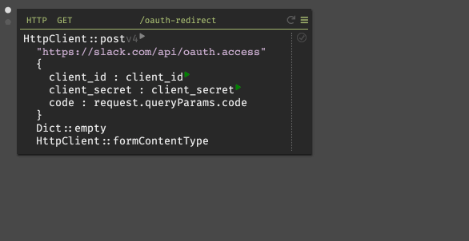
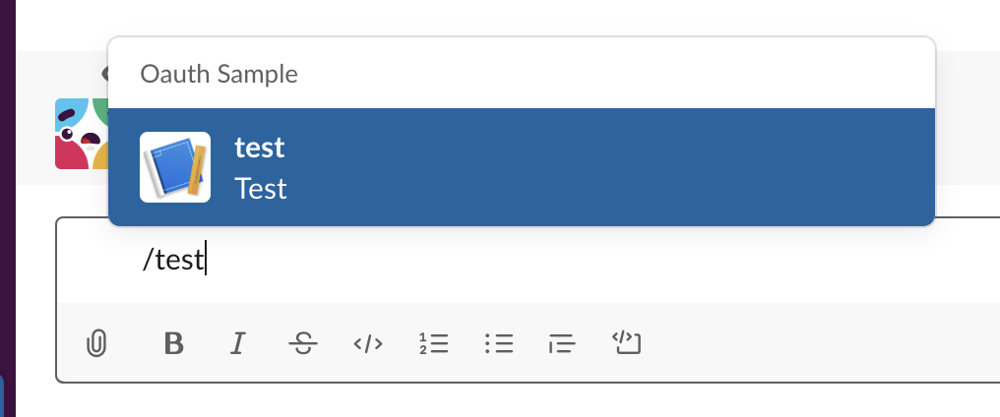
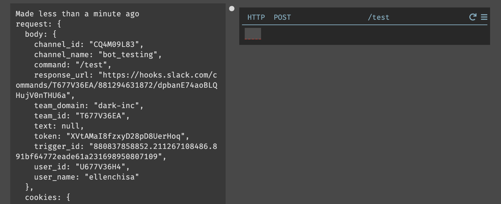
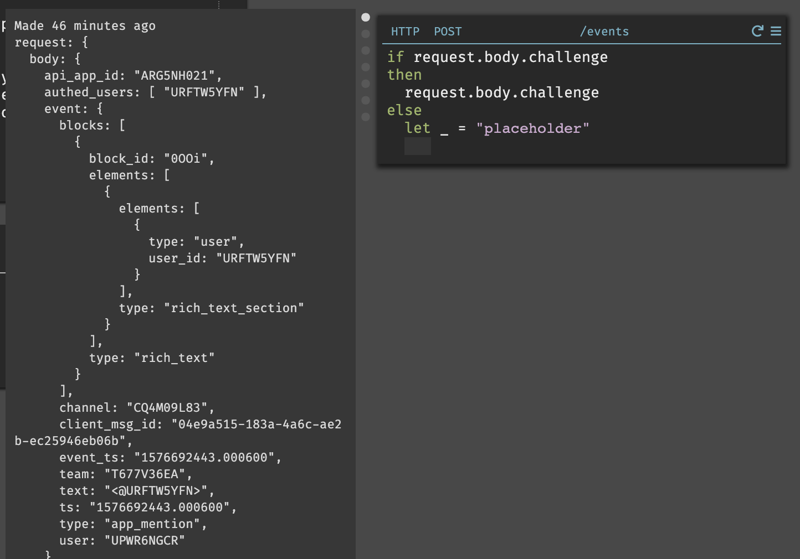
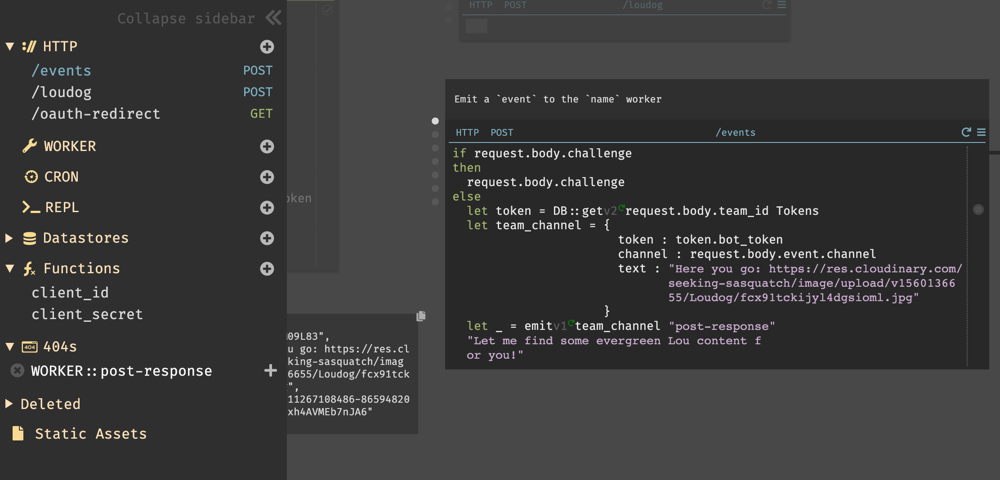
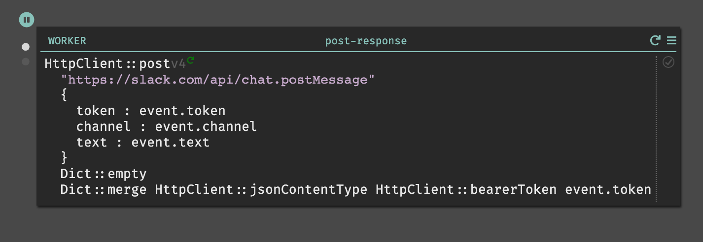

Watch a demo video of a Slack app: [https://vimeo.com/380770154](https://vimeo.com/380770154)

#### Getting started

Dark allows you to build backends (API endpoints, workers, cron, and data storage) by writing only your business logic, using production traces. You can access your account from darklang.com/a/USERNAME-CANVASNAME. For this project we recommend darklang.com/a/USERNAME-slackapp.

We recommend building a hello world API endpoint to get a feel for Dark, as follows:

All the major handlers work the same way, but the key for many requests is working directly with incoming data. If you’ve never used Dark before, it may be helpful to take a quick look at the [editor explanation](https://docs.google.com/document/d/1swhQBeCx1Ykly1SJfjVFiPiXuevcEyzPLkc04dMKbgQ/edit#heading=h.75uupsex1kqv).

This guide will walk you through how to set up a Slack application, trigger events from it, and write the corresponding backend logic. Our app is called Lou Dog to the Rescue and sends photos of Lou, (one of) our office dogs.

#### Creating a Slack App

Create a new Slack App from [https://api.slack.com/](https://api.slack.com/)

In order to install the app to your workspace, you’ll need to have the proper permissions. If you can’t, you can [set up your own workspace](https://slack.com/create) for testing instead. Please don’t use the Dark community Slack, as it’s a free community and we can’t support them all.

In order to install your app to your workspace, or distribute it elsewhere, your app will need to support at least one feature or functionality.

Add a /test slash command to start, and point the request URL at USERNAME-CANVASNAME.builtwithdark.com/test:

(If you’d like, you can add other features & functionality here, like a bot, but this is enough to build the base of the application and get started).

#### Step One: Setting up OAuth (Relatively Painless!)

In order to allow your app to be distributed, let’s quickly set up OAuth ([Slack’s OAuth Documentation](https://api.slack.com/docs/oauth)).

**Manage Distribution.** From your Slack App’s Manage Distribution page, add a redirect URL.

The URL you provide will need to be in the following format: [https://USERNAME-CANVASNAME.builtwithdark.com/OAUTH-REDIRECT](https://username-canvasname.builtwithdark.com/oauth-redirect)

Make sure you click on the option to Save URLs, then navigate to **Settings > Manage Distribution** and copy the Shareable URL to your browser’s address bar.

--

***Before continuing, please visit the Shareable URL to install the application.*** By visiting this URL, you’re making sure you have a real trace to work from in Dark. If you’re new to Dark, [Trace driven development](trace-driven-development.md) is a good overview of why.

--

Once you click on **Allow**, and then you’ll see a 404 error, since we haven’t written the backend logic.

Go back to your Dark canvas; we’ll use this 404 to start building.

In Dark, you work with production traces to build your backend. **Click on the “+”** next to your 404 to create an HTTP handler that will respond to OAuth requests.

After creating the route, you’ll see the trace showing the full request that Slack made to your Dark app. This includes the code you’ll need to send back to Slack.

Before we send it, you’ll need your client_id and client_secret, which you can get from Slack’s **Basic Information** page.

Type the code below into your handler in Dark. As you enter it, you’ll see that the trace is used to show you the results of your code, as well as helping the autocomplete. When copy/pasting your client_id and secret_id, you’ll need to open the string literal first (“) and then paste (otherwise it looks like a float and is truncated).

If you receive an `oauth_authorization_url_mismatch` error, modify the URL to `https://slack.com/api/oauth.v2.access`.

This is the end result, but you’ll see your client_id and client_secret instead of placeholders:

This calls part of Slack’s API ([oauth.access](https://api.slack.com/methods/oauth.access)), which will give you access to the Slack app that requested it.

When you’ve done this correctly and hit “play” to make the call ([more on play buttons)](trace-driven-development.md#live-values--play-buttons), you’ll get a response that has the right fields. This will include team_id and an access_token. (This may also have a bot_access_token if you add a bot to your Slack functionality).

If you get an error in a response, you won’t be able to keep going. If the code expired, you’ll need to re-open the shareable link from Slack in the browser to re-authenticate.

You can save the response to a variable by inserting a let (option-x -> wrap-in-let). You can also just hit return at the end of the function and it will do the same thing:

Now save the tokens you receive to a Datastore.

Create a new datastore from the omnibox, and set up a schema that matches the fields you want to save (in our example for Lou the Dog, team_id, access_token, and bot_token - depending on your feature set you might not have a bot_token).

Then, write the following logic to put values in the datastore (this requires a successful exchange of code for token).

Our sample canvas showing this OAuth for Slack can be found [here](https://darklang.com/a/sample-slackoauth).

#### Step Two: Building Application Functionality & Working with Slack’s Payload

Now that you’ve installed the app to your workspace, you can build app functionality. We’re not going to go through everything you can do, but rather give you an overview.

#### Supporting Slack Commands

Slack’s **Basic Information** page lets you create slash commands, event subscriptions, and interactive components. All three of these options require a Request URL, which is just a url pointing to your Dark app, in the same format as before:

[https://USERNAME-CANVASNAME.builtwithdark.com/ROUTE](https://username-canvasname.builtwithdark.com/ROUTE)

Trigger one of these routes, and then use the 404 and trace to build out the functionality, in the same way you did with OAuth.

For instance, if you used the sample slash command, /test, you’d get this result after triggering it in Slack (and it would appear in your 404 section in Dark).

When you create the endpoint from the 404 section, you’ll be able to work with the trace:

#### Supporting Bots & Event Subscriptions

You can set up a bot that listens for its name by adding [app_mention](https://api.slack.com/events/app_mention) under Subscribe to bot events in **Features > Event Subscriptions**.

The command will be sent to the URL you specify and, like OAuth, the route will show up in your 404s. Event subscriptions require that you respond with a challenge parameter to validate the URL that handles that interactivity. This challenge is only sent once, but you can wrap the challenge response in an if/else in the event that you need to validate this URL again:

#### Handling Incoming Data

Once you’ve set up your request URL or event subscription, you’ll be able to receive and work with incoming requests.

As before, use the trace to extract the values you’ll need to post your response.

So far, we’ve typically posted a message to Slack directly from an HTTP handler. However, it’s better practice to do this using background workers when posting to external API endpoints. Workers respond to events asynchronously, and queue events if they fail. You can use **emit** to trigger a worker, and when you hit play, you’ll see the worker appear in your 404s:

We’ll use Slack’s [postMessage](https://api.slack.com/methods/chat.postMessage) method to respond to a direct mention with a message in Slack, and write the code to post the response in our worker:

If you want to support interactivity that involves working with buttons, menus, or fields within a modal, this may change the shape of Slack’s payload into a string with nested lists. There are several functions you can use that will help with data wrangling in those cases:

- **JSON::parse** - Parses a JSON string and returns it’s value.
- **Lambda** (or \) - for creating anonymous functions that are most helpful when iterating through lists
- **|>** (or shift + return) - to pipe into another expression
- **List::getAt** - For when you know the index of the nested list that contains your value.

Here is an example of where most of these functions are used to extract the right values and to help draft a reply:

