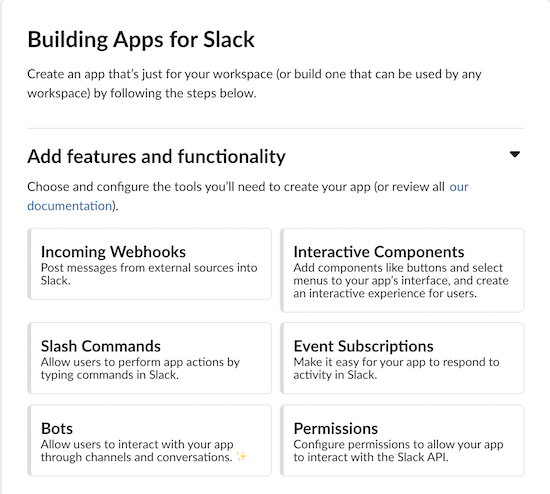
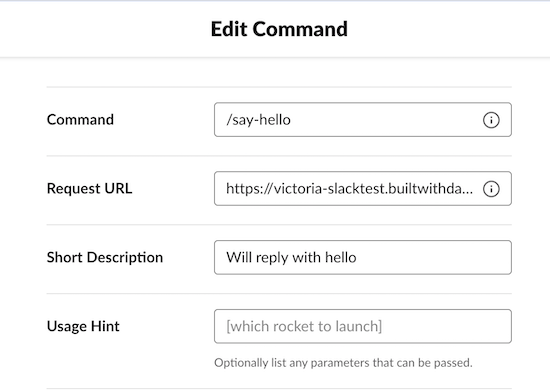
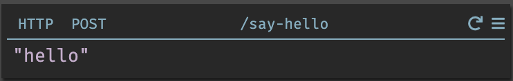

Building Slack apps in Dark is a quick and easy process. This page will cover
the basics, but more specific examples are covered in the tutorials.

## Slack Configuration

Start by creating an app in Slack. You can do so quickly by clicking
[here](https://api.slack.com/apps?new_app=1). Note that you will need to have
the ability to add apps to at least one Slack group in order to create an app.

Once you've created your app, you will see a page with quite a few options:

You're going to need to configure at least one of these options before you can
install the app to your workspace. The quickest option is to use a slash
command. When you create the command, you will be asked for a Request URL. This
should be pointed at your Dark canvas and look something like
`https://username-canvas.builtwithdark.com/my-command`.

Once you have your slash command, you will be able to install your app to your
Slack community via the Basic Information page.

Once you have your app installed, you will be able to see your slash command in
your Slack app:

## Building in Dark

Try calling your slash command. You will get an error that looks like this:

Navigate to the Dark canvas you used in the Request URL and check the 404s
section - you will see an entry with the same name you used above.

Click to create your handler, and then add a string to the return value:

Return to Slack and try out your Slack command again. You should now see a
response:

Congratulations - you've built your first Slack app!
