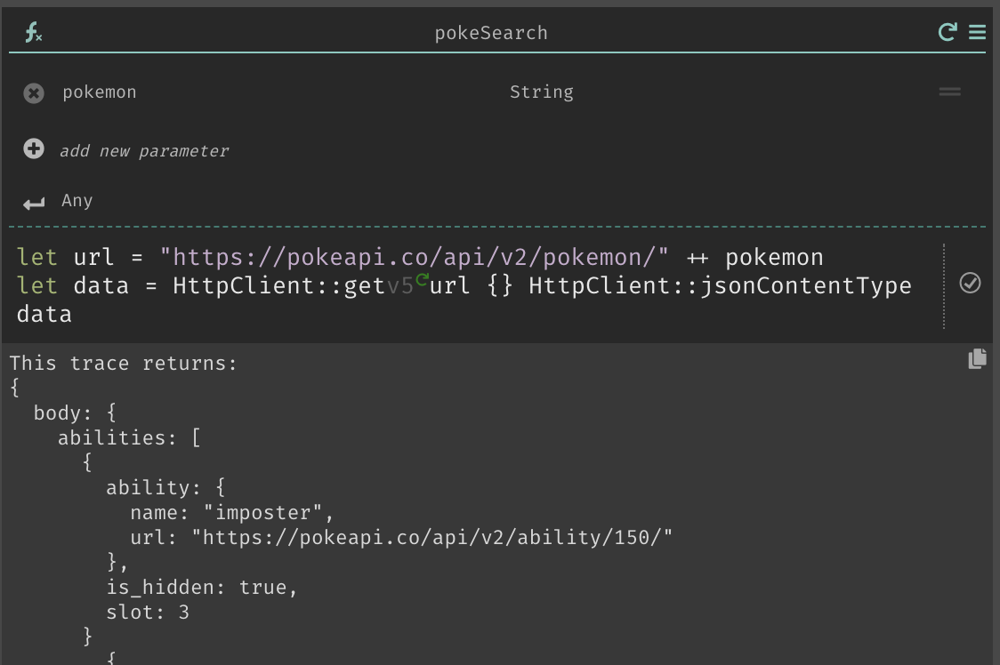

In this tutorial, we will be showing you how to use the error rail with `HttpClient::get` to display clean error messages. We will be using the [PokeAPI](https://pokeapi.co/), as it is publicly available and requires no special authentication.

1. Create a new function from the omnibox or sidebar. Call this function `pokeSearch` and add a Pokemon parameter with type `String`.

2. Now, use your new function by creating a new REPL named search and calling your `pokeSearch` function with `"ditto"` as the parameter.

3. Return to your function and check your traces - you should see a new one with `"ditto".`

4. Create your URL by concatenating `https://pokeapi.co/api/v2/pokemon/` with your parameter.

5. Write your `HttpClient::get` call.

6. Return the results of your `HttpClient::get`. Note the check mark in the circle to the right of your call - this is indicating that your function is on the Error Rail, and that it isn't returning an error.

7. Return to your `search` REPL and enter anything other than the name of an actual Pokemon. I chose `"pikawho"`.  Then, run your REPL again to see the `Error` trace.

8. Return to your `pokeSearch` function, and note that the check mark has changed to a red exclamation point, indicating that there is an error.

9. Place your cursor in `HttpClient::get,` [open the command palette](../structured-editing#command-palette), and select `take-function-off-rail`.

10. Once you do, you'll notice that the Error Rail icon on the right disappears, and your return trace will update.

11. Now, we're going to use a `match` on `data` to return the result we want. Here, I've said that if `data` returns an `Ok` we can just return data, and if `data` returns an `Error` we will print out a nice error message.

12. Return to your `search` REPL, and re-run it. You'll see your nicely formatted error message. 

13. Try again with the name of a real Pokemon to confirm that, when there is no error, `data` is returned.

Congratulations! You've now successfully taken a function off of the error rail to write a custom error message!
