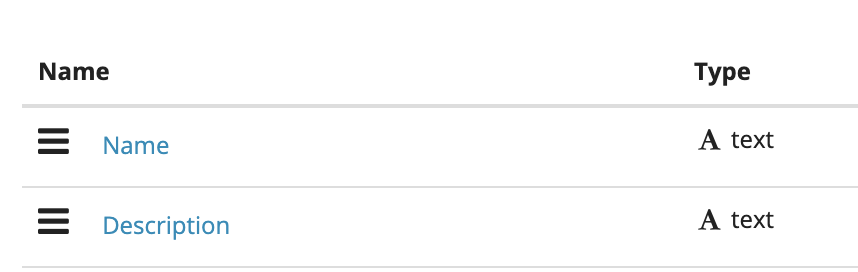
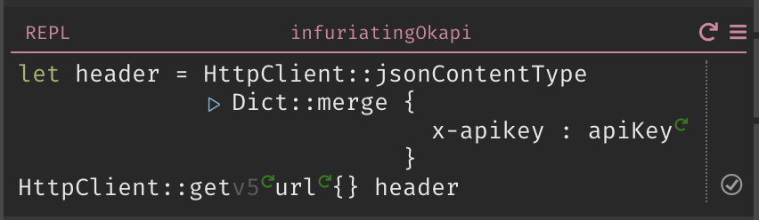

Your project may require a more complex data structure than our datastores. If a key-value store works, we strongly recommend using the built-in datastore to take advantage of language functions. 

If you already have (or otherwise require) an external database, any external database that provides a REST API can be used. For the purposes of this tutorial, we will be using [restdb.io](https://restdb.io).

## Set Up

1. Create a new database.

2. Select **Developer Mode** in the upper right, and then choose **Collections +**

3. Enter the information for your new collection and click **Save**.

4. Add Name and Description text fields to your database by clicking **Add Fields +**. 

5. Grab your API Key by clicking on API Docs and finding the value labeled **x-apikey:**. Save it as a function in your Dark canvas.

6. Optionally, also grab the URL at the top of your page (in my case, its `https://mydatastore-e7f9.restdb.io/rest/mydata`) and save it as another function in your Dark canvas.

## POST a New Record

1. Create your header by doing a `Dict::merge` on `HttpClient::jsonContentType` and a dict comntaining your API Key

2. Write an `HttpClient::post` using your URL, your fields (note: the field names are case sensitive) and your header, and then run it.

3. Your data will appear in the restdb.io console.

## GET All Data

1. Create your header by doing a `Dict::merge` on `HttpClient::jsonContentType` and a dict comntaining your API Key.

2. Write an `HttpClient::get` using your URL and header, and then run it.

3. Your handler will return all of the data in your database.

