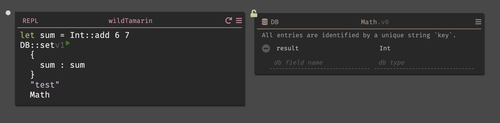
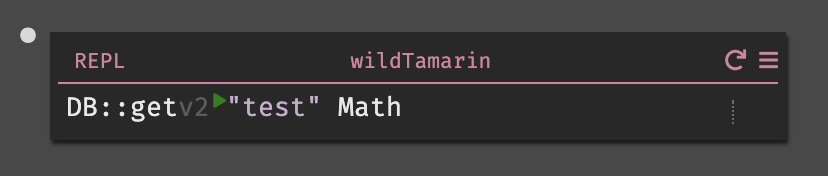
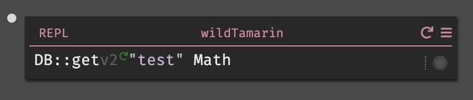
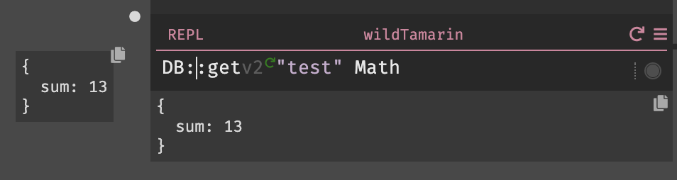

Dark being connected to the editor and infrastructure allows for unique language functionality.

## Play & Replay Buttons

The language being connection to the editor and infrastructure allows interactive functions.

- Functions that do not have side effects (like `Int::add`) run automatically.
- Functions with side effects have play buttons. Press the play button to execute the function for the selected trace.

The replay icon indicates the function has been executed already. Pressing it executes the code for the trace again again.

Replay an entire handler for the selected trace (including all functions within the handler) in the upper right. This would replay `DB::generateKey` and `DB::set`.

## Function Versioning

You can see that many standard library items are labeled “`v3`” or “`v1`” in the editor. These refer to the version of the function. When you start a new canvas, you will always have the latest versions. If we upgrade, you’ll have the choice to do so, but can continue to use the old ones.

## Functions that use Error Rail

Functions that return Result or Option Types (like `DB::get` and `HTTPClient::get`) are handled by the Error Rail by default. The documentation in the editor indicates if this is the case for a given function.

The error rail allows you to keep writing code along the “happy path,” without stopping. This is based on [Railway Oriented Programming](https://medium.com/darklang/real-problems-with-functional-languages-efe668c5264a). The idea is that when you call a function which might not succeed, you can keep going. For example, if you try to look up a value in a dictionary or database, we don't make you immediately handle the error case.

An expression that returns to the rail has a signifier on the right hand side. Before it runs, there is a dotted line and no indication of a happy case or error.

Once it runs, it will show the happy case (circle) or error case (error signifier).

In the case of a "happy" value, you can just ignore the result and option type - we unwrap them automatically, as seen above. In the case of an error, the execution will end (similar to throwing an exception that isn't caught).

There are two different types that both operate this way: the Result Type (`OK`/`Error` or the Option type `Just val` or `Nothing`). Dark returns a 500 error for bad results and a 404 for bad Options.

| Type        | Happy Case | Error Case    |
| ----------- | ---------- | ------------- |
| Result type | OK val     | Error message |
| Option type | Just val   | Nothing       |

In the case above, when the function is on the rail, the value is as follows.

## Taking Functions off the Error Rail

When you are ready to handle error cases, you remove them from the rail by using the editor command `take-function-off-rail` (open the Command palette by hitting Option-x or Alt-x **on the function name**). This will unwrap the values.

In this case it unwraps to `Just val` and the behavior would be the same for functions that would return `Ok val`.

When the function is off the rail, instead of execution halting, you will handle it yourself.

Handling these errors is best done using a Match statement.

Live values on Match statements will show which branch executed. In this case, the first arm of the branch `Just result` executed, and `Nothing` did not.

More on Match is available in [Functional Aspects of Dark](https://darklang.github.io/docs/functional-aspects), and there is a sample [here](https://darklang.com/a/sample-match).
