## Your First App

We're going to take you through a tutorial to build an entire application that
uses Dark's basic functionality. This should take between 10m and 45m, depending
on how thorough you are.

If your account was created after March 2020, you can see a completed version of
this tutorial at _darklang.com/a/USERNAME-gettingstarted_. If you'd like to
start from scratch, navigate to a fresh canvas
(_darklang.com/a/USERNAME-gettingstarted2_, for example.)

A completed version of this tutorial, is also available at
[https://darklang.com/a/sample-gettingstarted](https://darklang.com/a/sample-gettingstarted).
Note that you should **not** copy/paste this &ndash; we want to teach you to use
the Dark editor.

### Support

If you'd like some help, come to the
[Dark Community Slack](https://darklang.com/slack-invite). Dark engineers answer
questions, talk you through issues, and fix bugs, often within minutes. Lots of
experienced community members are also around to offer helpful suggestions.

## Your Canvas

A Dark canvas is an integrated development environment (IDE), an HTTP client,
and a web server. You'll write code in the canvas with all the functionality you
expect from an IDE (text editing as well as code completion and debugging). The
canvas can compose and send HTTP requests, similar to API query tools such as
curl, Postman, or Insomnia. Finally, the canvas is a web application server: The
canvas can receive HTTP requests (including webhooks, requests from an ordinary
browser, or even another canvas). The Dark IDE runs in your browser at
[https://darklang.com/a/USERNAME-gettingstarted](https://darklang.com/a/USERNAME-gettingstarted)
and the Dark server responds to HTTP requests at
[https://USERNAME-gettingstarted.builtwithdark.com/](https://USERNAME-gettingstarted.builtwithdark.com/).

## API Endpoint

**Concepts:** Structural elements, blanks, implicit returns, traces.

Here you'll use the IDE to write code (an API endpoint) that responds to a
browser HTTP request.

1. Create a new HTTP endpoint from the omnibox (click anywhere on the screen or
   hit `Cmd-k`/`Ctrl-k`), or from the plus next to `HTTP` on the sidebar.


2. Enter the HTTP verb as `GET` and `/math` for the route.


3. You can now write any code in the blank &ndash; this is the return value of
   the API endpoint that you've just created. To start with, let's just return
   `4`.


4. Click the handler's menu (☰) in the upper right and select "open in new tab",
   to see your API endpoint running in production.


5. Go back to Dark to edit your code. Add `+ 5` to the end of the code and leave
   your cursor in line.


- The `9` below the handler shows you the return value for the handler.

- The `5` on the left shows you the result of the expression where the cursor
  currently is (in this case, 5). This isn't very useful when it's an integer,
  but if it's a variable it will show you the result of the variable.


6. Mouse over the white dots on the left. Each dot is a "trace", representing a
   single request to your handler. Traces are fundamental to coding in Dark, and
   we'll come back to them later.

Congratulations! You've shipped your first Dark API endpoint.

## REPL

Here you'll use the IDE to write code that sends an HTTP request. You'll use the
HttpClient library to make an API call from an interactive interpreter (often
called a REPL or Read-Eval-Print Loop).

**Concepts:** REPLs, HttpClient library, Play buttons

REPLs in Dark are general-purpose coding blocks. They're typically used in the
way you might write a bash script (reusable tools), use traditional REPLs
(experiments and one-off commands), or admin dashboards (simple reporting).

We'll run you through creating your first REPL, experimenting with the
HttpClient library to make API calls.

1. Create a new REPL from the sidebar or the omnibox (`Ctrl-K`/`Cmd-K`).

2. Type "httpclient" in the REPL (lowercase, no spaces)


This will show you all the standard library functions for HttpClient, their
signatures, and their docstrings.

3. Continue typing, until you have "httpclientpost". Dark autocompletes on
   substrings so getting the exact text isn't important:


4. Hit enter to add the function into the handler.


Dark automatically creates blanks for the four arguments that `HttpClient::post`
requires (URI, body, query, and headers). We display a gray play button beside
the function &ndash; it will turn green when all the arguments are complete,
allowing you to run the function from within the editor.

The URI is the destination of our HTTP request (an API endpoint). We could make
a request to any web server; for this tutorial, we'll make a request to the
canvas we're working in. We haven't yet written the code that will respond to
the request; you'll see what happens when the canvas receives a request without
a prepared endpoint. The canvas will respond with a 404 "page not found"
response.

5. Let's call a new `/test` endpoint for the application we're developing. As we
   saw from the GET, our endpoints live at
   USERNAME-gettingstarted.builtwithdark.com, so enter a string like
   `"https://USERNAME-gettingstarted.builtwithdark.com/test"`. Be sure that
   you've substituted your username correctly. Also be sure you are using the
   correct canvas name (for example, if you send the request to
   "mygettingstarted" or "getingstarted" the wrong canvas will respond and you
   will not see the 404 result).


6. Next let's add the arguments. The structured editor simplifies creation of
   the arguments we want:

- For the body, we want to pass `{test:"test1"}`: type `{`, hit enter, then add
  the key and the value.
- For the query, we want an empty dictionary. Type `{`.
- For the header, we want the JSON content-type: type `json` and the
  autocomplete will offer you a function to use.


7. Once we've filled in all the arguments, the play button (▶️) next to the
   function turns green, which means we can execute this code from within the
   editor.


8. Hitting play we receive a 404 response. This is because there's no `/test`
   endpoint on our canvas (yet!)

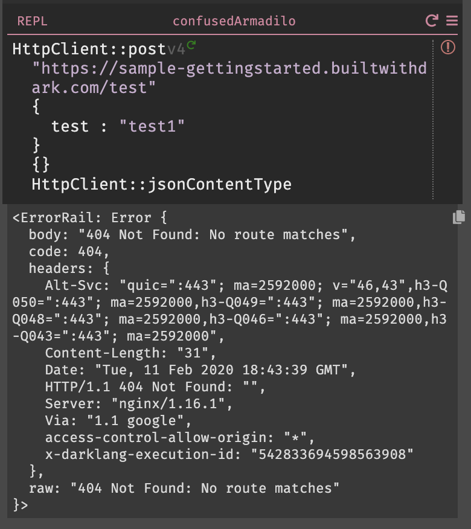

9. 404s in Dark appear in the 404 section of the sidebar. We'll discuss that
   more later.


Congratulations! You've built your first REPL and called your first function in
Dark.

## Datastore

In the last section, we made a HTTP request that created a 404. We'll use _the
trace_ of that HTTP request to build an endpoint, a technique we call **Trace
Driven Development**.

1. Hit the plus (+) button in the 404 section of the sidebar. This creates a
   HTTP endpoint with the HTTP verb (POST) and path (/test) set from the request
   that creates the 404. Notice that the 404 event disappears from the sidebar.
   That's because we've created an endpoint that will respond to the request.
   Making another request will not create another 404 result; instead it will
   add another trace to the new endpoint (a trace is represented as a white
   dot).


2. Hover over the white dot on the left hand side. Here, you can see the full
   body of the incoming trace from when you posted to the endpoint from the
   REPL, including the body. If you've made multiple requests to the endpoint,
   you'll see multiple white dots, each corresponding to a request.

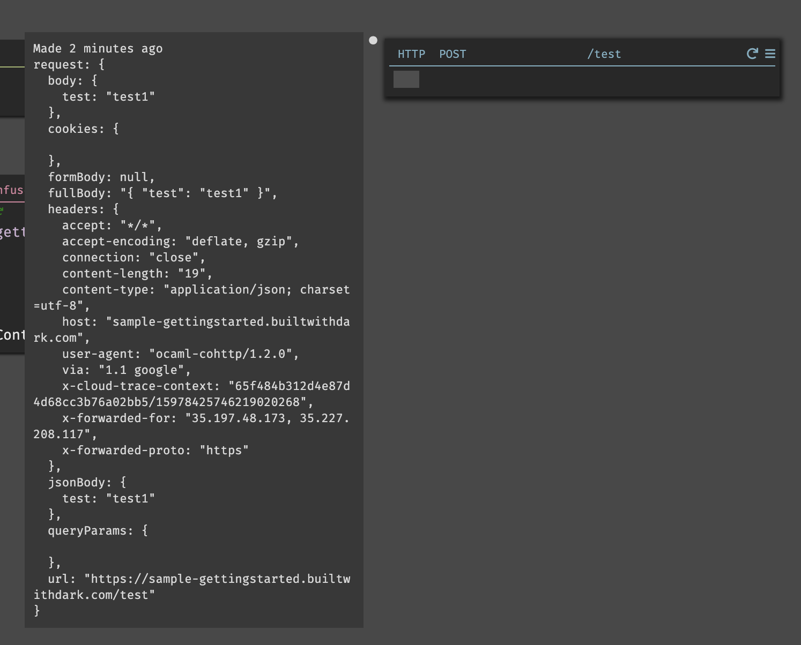

3. Let's save the `request` body to a variable by typing
   `let data = request.body`. As you can see, the autocomplete knows the field
   names of `request` from the trace, and will complete them for you.


4. Let's put this in a datastore. Like we saw with the `HttpClient` library,
   typing "DB" in the blank will pull up all datastore functions.


In this case, we want `DB::set`, which takes three arguments.

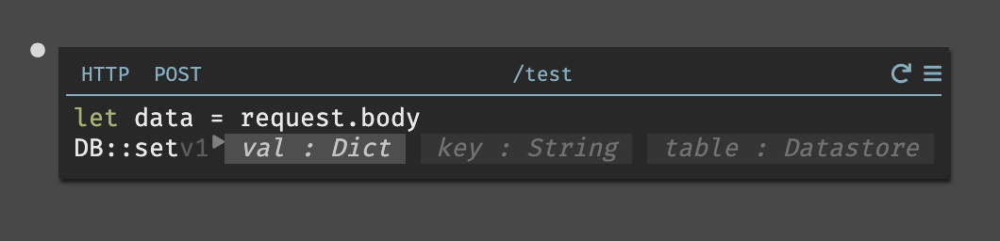

5. Now let's make our datastore. From the sidebar or the omnibox, create a new
   datastore called "Requests", with fields `data` and `time`.

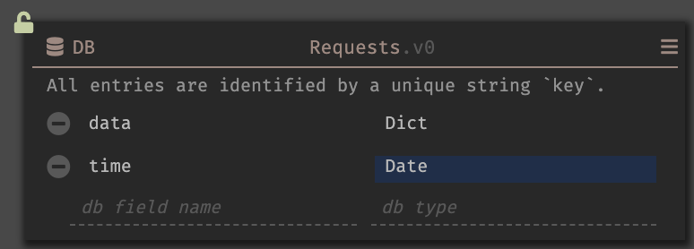

Dark's datastores are key-value stores; each record has a unique key that is
used to store and retrieve the value. For instance, a possible set of records
with keys in the above datastore would look like this:

```text
{
  key1: {
          data: {
                  test: "test2"
                },
          time: <Date: 2020-02-11T18:54:39Z>
        },
  key2: {
          data: {
                  test: "test1"
                },
          time: <Date: 2020-02-11T18:54:43Z>
        }
}
```

6. Now that we have a datastore, let's finish our post endpoint.

   The first argument is the record we're inserting. This needs to match the
   schema, and so it needs to include both `date` and `time` (you cannot insert
   records that are missing fields). Insert our data from above (seeing the live
   value to the left) and use the `Date::now` function to get the `time` field.

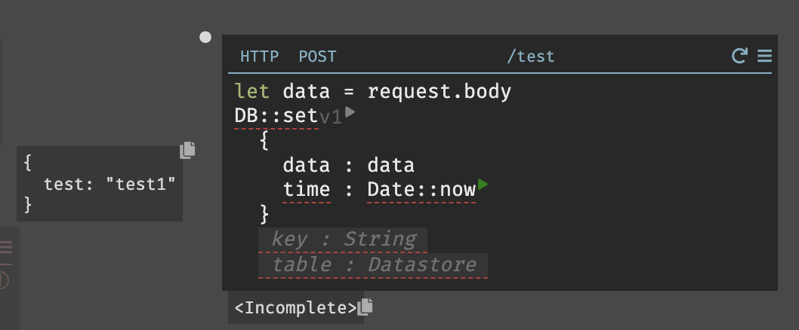

7. We need a unique key for each record that we store. The `DB::generateKey`
   function generates random keys &ndash; this is useful when your record has no
   obvious unique identifier.


8. The final argument is the Datastore: `Requests`.

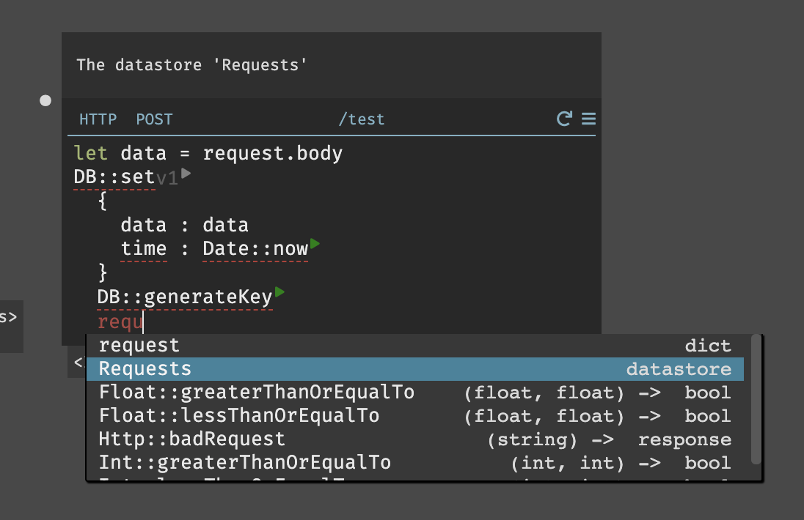

9. To call the `DB::set` function, we first need to run the two functions with
   side effects (`DB::generateKey` and `Date::now`) by hitting the play button.
   After hitting those two play buttons, the `DB::set` play button will be
   enabled:


10. Finally, hitting the play button for `DB::set` inserts the record into the
    datastore. This locks the datastore, preventing us from changing the schema,
    which we see indicated by the red lock (🔒) icon.


## Cron

Now that we're storing requests, we can use a scheduled job (a "Cron", named
after the Unix cron utility) to create a report of all requests per day.

1. Hit the plus (+) button (or use the omnibox) to create a new Cron. Set it to
   run daily, and with the name `DailyReport`.


2. To know if a request was executed today, we compare it to the current time.
   Let's assign the current time in seconds to a variable `timeSeconds`. The
   current time in seconds is `Date::now`, piped into `Date::toSeconds`. (Note:
   to create a pipe, type `|>` after the `Date::now` function).

   Run the `Date::now` function to see a live value for your code.

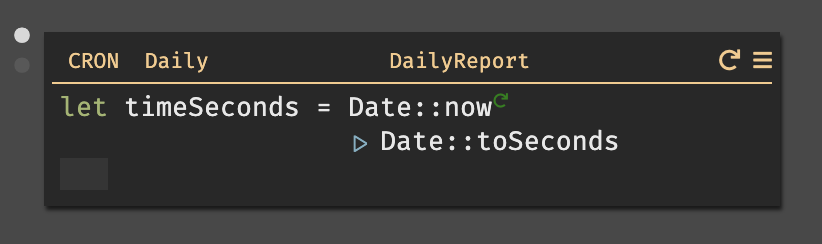

3. Next, we'll need to filter the reports to just today's reports. Set
   `allRequests` to `DB::getAll Requests`. Run the function to the live value
   for `allRequests`.


4. To see only today's requests, use `List::filter`. `List::filter` takes two
   arguments - the list to filter (in this case `allRequests`) and an anonymous
   function that determines if each element of the list element should be
   includes in the new list. `List::filter` is similar to `List::map` and the
   concept is explained in more detail
   [here](https://darklang.github.io/docs/functional-aspects).


5. We want to keep only reports that occurred today, meaning we want to compare
   the report's time to `timeSeconds` that we created earlier. Let's convert the
   time of the request into seconds so that both times have the same units.


6. Next, we calculate the difference from the current time; this tells us if it
   happened today (in the last 86,400 seconds).


7. To see this work, it's helpful to have a recent request. If you paused in the
   tutorial, re-run the `HttpClient::post` function from the REPL. Then, when
   you place your cursor in `todayRequests` or `List::filter` you'll see a list
   of requests from the last 24 hours.


8. Finally, let's emit today's requests to a background worker, using the `emit`
   keyword. `emit` takes two arguments, and in this case we're sending
   `todayRequests` to a not-yet-created worker named `storeReport`.

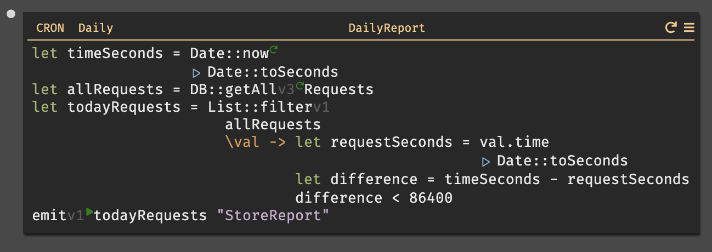

9. To have our first report run, hit the "replay" button in the upper right of
   the Cron. This creates a 404 in the sidebar for the Worker `storeReport`.

## Worker

Workers process jobs in the background, ideal for daily reports. They're also
commonly used for sending notifications and other asynchronous tasks that we
don't want to handle in HTTP requests.

If we were doing this for real, we might send the data to a 3rd party API over
HTTP. But for the sake of simplicity, let's just store the data into the
`DailyReport` datastore.

1. From the 404 section of the sidebar, hit the plus (+) button to create the
   `storeReport` Worker. The Worker will already be named, and hovering over the
   white dot will show you the event triggered by your cron.


2. For the report, we're going to store our data by human readable dates (like
   `02-27-2020`). First, we'll get the current date, and then get the pieces and
   re-aggregate them.


3. The `event` we received is not the exact shape we want. Let's process it
   using `List::map` to keep just the `data` field.


4. Make a second datastore with three fields: the nicely-formatted date, the
   list of requests, and the count of requests for that day.


5. To get the count, use `List::length`. Then we store it in the DB, using
   `humanDate` as the key.


6. Now, our first datastore stores each incoming request, and every 24 hours our
   Cron runs, sending the right reports to our worker, which stores a report in
   our second datastore.

## Function

Let's look at creating a function to return a human readable summary of the
number of reports for each day.

The best way to create a function is by writing the code you want as part of
your handler, and then extracting the working code to a function. This ensures
that whatever code you write has traces and live data.

1. Start by creating a new REPL.

2. In the REPL, call `DB::getAll` to get the reports from the datastore. Run the
   function using the play button (▶️).


3. Open a pipeline by typing `|>`, and pipe into a `List::map`, and create
   variables `date` and `count`.


4. Pipe `val.count` into `toString` (shift-enter on a selected area also pipes
   that expression).


5. Return `date ++ ": " ++ count` in the last line of the block.

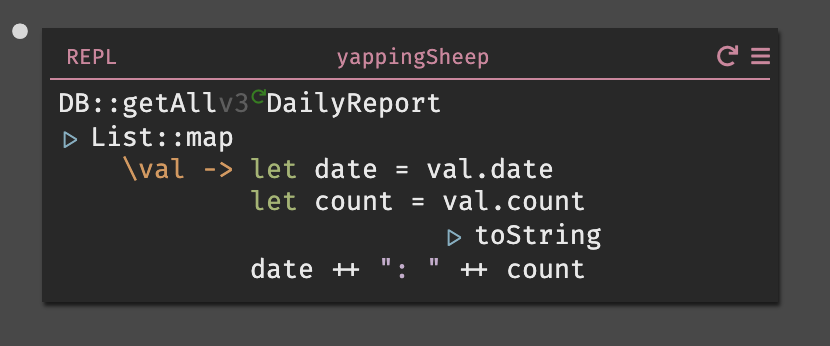

6. We now have the code to generate our formatted report.

   Let's extract that code into a function. Select all the code within the REPL.


7. Type `Ctrl-\` (Control-Backslash) to open the command palette, then select
   `extract-function`.


8. This creates the function, and replaces the existing code with a call to the
   new function.


9. Click on the function reference on the right hand side of the handler to go
   to the function and rename it.


Functions do not live on the main canvas. They are reusable and can be called
from any handler.

This function does not have any parameters. When you add parameters, the editor
will automatically create blanks for the arguments everywhere the function is
called.

10. Go back to the primary canvas via the sidebar, the mini-map, or a reference
    on the right-hand-side of the function. Once back, create a new HTTP GET
    handler and call the function. This creates an API endpoint which returns
    the daily reports.


## External API Call

Dark has built-in standard libraries for working with external HTTP Calls
(`HTTP` and `HttpClient`). This allows you to work with any external REST APIs.

In this Tutorial, we'll send the Daily Report we created to Airtable, so other
team members can see it.

1. Set up Airtable (~10 minutes).

- Go to [Airtable](https://airtable.com) and create a new base.
- In the base, create two columns, one for date (field type is date) and one for
  requests (field type is number). You can see our sample
  [here](https://airtable.com/invite/l?inviteId=invOadxgcpBKaCQiv&inviteToken=e7492a049bf7e4cd1c475b43efac35d296578f66198bff549ca99af6ee5821b4).
  
- Generate an API key on the [Account page](https://airtable.com/account). Put
  the API key in a function in your Dark canvas.
  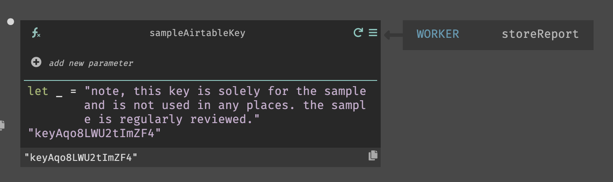
- Airtable's full API documentation for your base will be available on the
  [API page](https://airtable.com/api). Within this page, go to Create Records
  in the left hand navigation to copy the URI from the right hand side.
  

2. Add the HTTP POST call to the `storeReport` worker so it will run
   asynchronously. Hit `return` after the `Db::set` function. `DB::set` will
   still run as a side effect, and we can add the new function.


3. The `HttpClient::post` function takes four arguments. Paste the URI from
   Airtable from the base into the first argument.


4. Above `HttpClient::post` declare a new variable, `airtable_header`. Use the
   `HttpClient::bearerToken` and pass your API key function as the argument.
   Then, pipe `|>` into `Dict::merge` and merge with
   `HttpClient::jsonContentType`. The `airtable_header` will now be a nicely
   formatted header for the Airtable API.


5. The query can be empty for this particular request, but we do need to provide
   an argument, such as `{}`.

6. Add the information from the report to the body (the date and number of
   requests). Airtable expects the following format:  
   `records : [{fields : {Date : date, Requests : count}}]`


7. Run the API request in the editor by hitting the play button next to
   `HttpClient::post`. If the request is successful, a success will be returned
   and you'll see the record in your Airtable base.


If the request is not successful, the error message will be displayed in line,
and you'll see the `Error` on the error rail. In this case, the format of the
date passed did not expect what Airtable expected.

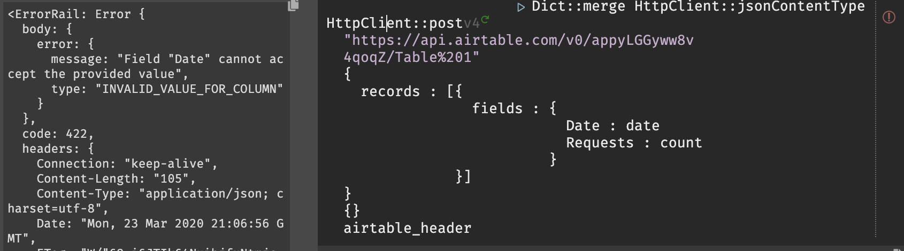

8. Each time your cron runs (daily, or when triggered) a record will be added to
   your Airtable base.

## Finishing Touches

Try it out:

- Change your REPL to say `"test3"` instead of `"test1"` and then re-run the
  request by hitting the play button.

  

- A new trace dot will appear on the HTTP Post `/test` handler. It shows
  `"test6"` in the body of the request.

  

- The new request will be in the Datastore, and if you open your reports
  endpoint tomorrow, you'll see a log of all the new requests, as well as
  updates to your Airtable base.

## One Last Thing

At this point you'll have a cron that runs daily adding a row to your Airtable
project. Since we don't want that to happen forever you can do one of two
things.

1. Click the pause button in the upper-left corner of the worker.
2. Add logic to your cron that will skip days that have no entries.

If you want to do the latter, make the adjustment to the cron process by adding
the last 6 lines: assigning the length of `todayRequests` and then conditionally
emitting `todayRequests` to the `StoreReport` worker or not.


Congratulations! You now have your first Dark application: an API that stores
requests into a datastore, creates a daily report of those requests, and sends
the report to Airtable.
